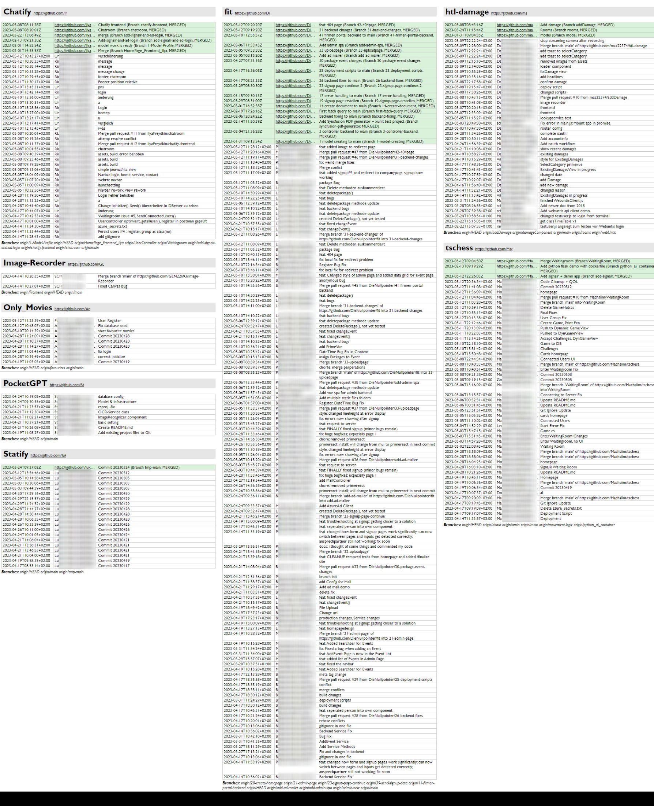

# Skript für den HTML Export des git logs (für Lehrende) :fearful: 

Um den Status der Repositories von Klassen leicht prüfen zu können, gibt es ein Skript zum Download.

**Variante 1:** Nur *git fetch* + Auslesen der Logdatei ohne Veränderung der lokalen Dateien.
- **[Download check_logs.sh](check_logs.sh)**
- **curl:** `curl https://raw.githubusercontent.com/schletz/Pos3xhif/master/06%20Git/check_logs.sh -o check_logs.sh`

**Variante 2 (bevorzugt):** *git fetch* mit *git reset* und Auslesen der Logdatei.
Das ist nützlich, wenn du den Stand von github auf der Platte und nicht nur im lokalen Repo haben willst.
- **[Download check_logs_with_reset.sh](check_logs_with_reset.sh)**
- **curl:** `curl https://raw.githubusercontent.com/schletz/Pos3xhif/master/06%20Git/check_logs_with_reset.sh -o check_logs_with_reset.sh`

**Variante 3:** Prüfen der pull requests.
Das ist nützlich, wenn du eine Übersicht über alle pull requests haben willst.
Die Daten werden pivotiert in *pullrequests_pivot.txt* geschrieben.
- **[Download check_pull_requests.sh](check_pull_requests.sh)**
- **curl:** `curl https://raw.githubusercontent.com/schletz/Pos3xhif/master/06%20Git/check_pull_requests.sh -o check_pull_requests.sh`

Das Skript wird unter Windows mit der *git bash* ausgeführt.
Unter macOS/Linux wird es normal in der Shell gestartet, setze mit *chmod 777* vorher die Ausführungsrechte.
Nach der Installation von git sind *.sh* Dateien automatisch damit verknüpft, du erkennst das am Symbol im Explorer.

## Vorbereitung

### Download des Github CLI Tools

Das Skript liest auch die Pull Requests aus.
Dafür braucht es das GitHub command line tool.
Du kannst es auf [cli.github.com](https://cli.github.com) laden.
Danach musst du dich in der Konsole mit `gh auth login` authentifizieren.
Installiere danach die Extension für github classroom, indem du den folgenden Befehl in der Konsole eingibst:

```
gh extension install github/gh-classroom
```

### Klonen der Repositories aus github classroom: *gh classroom clone student-repos*

> Für diesen Schritt musst du eine Klasse auf [https://classroom.github.com/classrooms](https://classroom.github.com/classrooms) und ein Assignment eingerichtet haben.
> Meist ist ein Assignment als "Arbeitsrepo" die richtige Wahl.
> Mit diesem Befehl sind nur Repos abrufbar, wo sich SchülerInnen mit einem Einladungslink zu einem Assignment eingeschrieben haben.
> Falls die Repos ohne Klasse angelegt wurden, kannst du auf [https://github.com/orgs/Die-Spengergasse/repositories](https://github.com/orgs/Die-Spengergasse/repositories) nach den Repos suchen und die ausgegebene Liste in einen Texteditor kopieren, die Zeilen sortieren und `git clone https://github.com/Die-Spengergasse/` vor den Namen schreiben.

Gehe in der Konsole in das Verzeichnis, wo du die Repositories haben möchtest (z. B. *3CHIF-POS*).
Führe danach in diesem Verzeichnis in der Windows Konsole (**nicht git bash**, denn die interaktive Eingabe funktioniert unter Windows dort nicht) den folgenden Befehl aus:
Tipp: Du kannst den Klassennamen eingeben, das Tool filtert dann bei der Eingabe die gefundenen Klassen.

```
gh classroom clone student-repos
```

Nun werden alle Repositories des Assignments auf die Platte geladen.
Hinweis: Das *check_logs* Skript lädt Änderungen vom Server, du musst nur 1x die Repositories mit *gh classroom clone* laden.

## Starten des Skriptes

Das Skript wird unter Windows mit der *git bash* ausgeführt.
Normalerweise sind nach der Installation von git *sh* Dateien schon damit verknüpft, sodass das Skript mit Doppelklick gestartet werden kann.
Kopiere das Skript *check_logs.sh* in den Klassenordner mit allen Repositories.

Beispiel:
```
📁 sj22-23-6aaif-pos-submissions
    ├──📂 sj22-23-6aaif-pos-user1
    ├──📂 sj22-23-6aaif-pos-user2
    ├──📂 ...
    └── check_logs.sh
```

Das Skript geht alle Unterordner (ausgehend vom Verzeichnis des Skriptes) durch und führt die folgenden Operationen aus:

```bash
git fetch --all --prune
git log origin --all ... >> "../log.html"
```

Es werden alle Einträge **der letzten 30 Tage** gelesen.
Die Statistiken über die Autoren bzw. die pull requests haben keine Zeitbeschränkung.
Die Variable *DAYS_AGO* steuert dies, du kannst sie in [check_logs.sh](check_logs.sh) leicht ändern.
Die Namen der Ordner werden als Überschriften ausgegeben.
Der origin wird als Link ergänzt.
Im Verzeichnis von *check_logs.sh* wird eine Datei **log.html** erstellt, die du dann im Browser öffnen kannst.
Beim erneuten Ausführen wird die alte Datei überschrieben.
Der Dateiname kann in [check_logs.sh](check_logs.sh) über die Variable *OUTFILE* gesetzt werden.

So sieht z. B. die Datei *log.html* einer (sehr fleißigen) Klasse aus:

