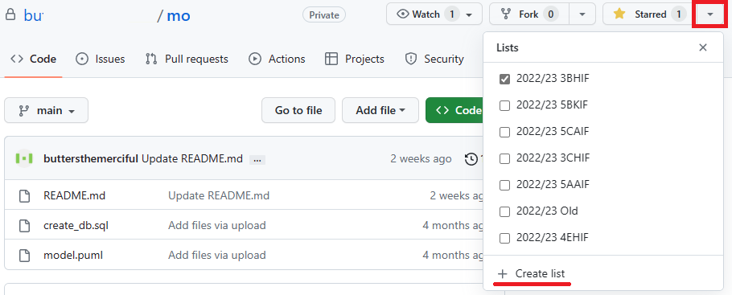
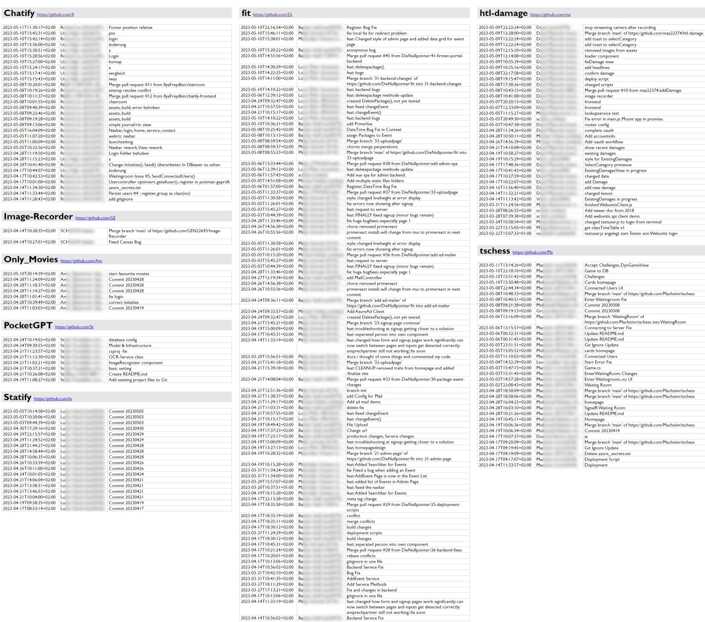

# Skript für den HTML Export des git logs (für Lehrende) :fearful: 

Um den Status der Repositories von Klassen leicht prüfen zu können, gibt es ein Skript zum Download.  
**[Download check_logs.sh](check_logs.sh)**

## Vorbereitung

### Einladung und Organisation in git

> Hinweis: Gehe mit deinen SchülerInnen das Kapitel [Installation und Konfiguration von git](01_installation.md) durch.
> Dort wird beschrieben, wie jeder seinen echten Namen als Autor setzen kann.
> Sonst bekommst du manchmal sehr seltsame Namen im Log.

Wenn deine SchülerInnen nicht mit [github classroom](https://github.com/Die-Spengergasse) arbeiten, und das Repository *private* angelegt wurde, muss dir der Eigentümer eine Einladung schicken.
In github classroom hast du als owner automatisch Zugriff.
Um die Repositories vernünftiger verwalten zu können, kannst du neben dem *Star* button das Repository einer Liste zuweisen:

[](git_star_list_1930.png)

### Klonen der Repositories

Am Besten gehe alle Repositories durch und schreibe dir die git clone Befehle in einer Textdatei oder bat Datei zusammen.

Beispiel:
```bash
git clone <url1>
git clone <url2>
git clone <url3>
```

Lege dann einen Ordner mit der Klasse an und kopiere diese Befehle in die Eingabeaufforderung (natürlich im Ordner der Klasse).
Tipp: Du kannst bei *git clone* auch einen Ordnernamen angeben, wenn die Repositories nicht mit dem Namen versehen sind:  
`git clone <url> "<ordner>"`

> Du kannst auch eine Namensliste z. B. aus Sokrates (unter *Auswertungen* - *Dynamische Suche* - *Aktive Schüler*) in Teams hochladen, per Link freigeben und dann die Klasse bitten, die URL des Repos auszufüllen.
> Dann kannst du dir die git clone Befehle per Excel Formel erzeugen.

> In *github classroom* kannst du über die Suche eine Liste der Klasse anzeigen lassen.
> Das Ergebnis kannst du markieren, in einen (vernünftigen) Texteditor kopieren, die Zeilen sortieren und dann einfach *git clone https://github.com/Die-Spengergasse/* vor den Reponamen stellen.

## Starten des Skriptes

Das Skript wird unter Windows mit der *git bash* ausgeführt.
Normalerweise sind nach der Installation von git *sh* Dateien schon damit verknüpft, sodass das Skript mit Doppelklick gestartet werden kann.
Kopiere das Skript *check_logs.sh* in den Klassenordner mit allen Repositories.

Beispiel:
```
📁 3CHIF
    ├──📂 Repo1
    ├──📂 Repo2
    ├──📂 ...
    └── check_logs.sh
```

Das Skript geht alle Unterordner (ausgehend vom Verzeichnis des Skriptes) durch und führt die folgenden Operationen aus:

```bash
git fetch --all --prune
git log origin --all --since="30 days ago" --date=iso-strict --pretty=format:"<tr><td><div>%ad</div></td><td><div>%an (%al)</div></td><td>%s</td></tr>" >> "../log.html"
```

Es werden alle Einträge **der letzten 30 Tage** gelesen.
Die Namen der Ordner werden als Überschriften ausgegeben.
Der origin wird als Link ergänzt.
Wenn du alle Einträge haben möchtest, kannst du den Parameter `--since="30 days ago"` anpassen bzw. löschen.
Im Verzeichnis von *check_logs.sh* wird eine Datei **log.html** erstellt, die du dann im Browser öffnen kannst.
Beim erneuten Ausführen wird die alte Datei überschrieben.

So sieht z. B. die Datei *log.html* einer (sehr fleißigen) Klasse aus:

