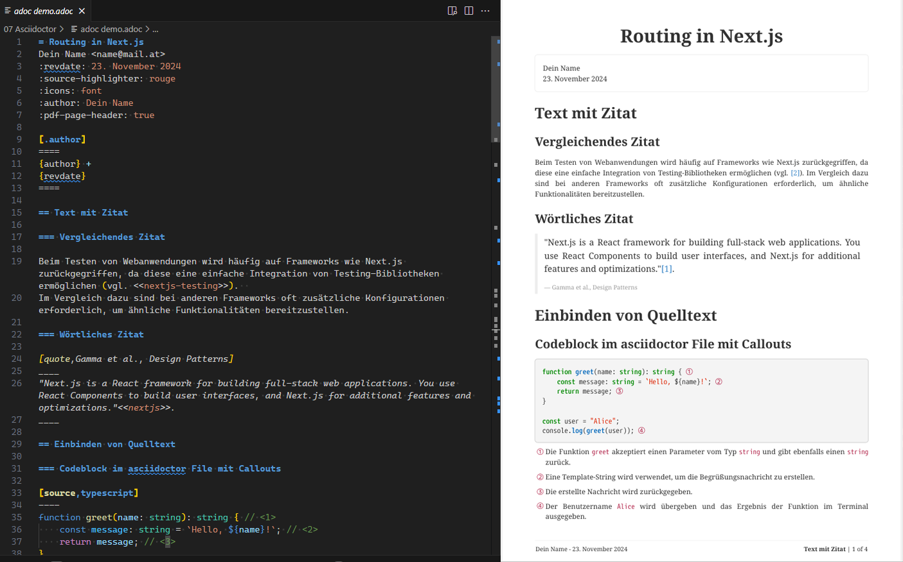

= Verwendung von Asciidoctor unter Windows und macOS
:source-highlighter: rouge
:icons: font
:lang: DE
:hyphens:
ifndef::env-github[:icons: font]
ifdef::env-github[]
:caution-caption: :fire:
:important-caption: :exclamation:
:note-caption: :paperclip:
:tip-caption: :bulb:
:warning-caption: :warning:
:folder: :file_folder:
:file-code-o: :page_facing_up:
endif::[]



Asciidoctor ist ein System, mit dessen Hilfe technische Dokumentationen in einem Textformat geschrieben werden können.
Der Aufbau ähnelt einer Markdown-Datei, Asciidoctor ist aber mächtiger.
Die Entwickler von Asciidoctor kennen scheinbar Microsoft Windows nicht; es gibt keine ausführbare Datei für Windows.
Mit Hilfe eines *Docker-Images* kann allerdings auch auf Windows-PCs die Installation sehr leicht durchgeführt werden.

[IMPORTANT]
Für die nachfolgenden Schritte brauchst du eine lauffähige Installation von Docker.

== Installation der Extensions für VS Code

Für Visual Studio Code gibt es Extensions, die das Bearbeiten von AsciiDoc-Dateien erleichtern.
Lade die folgenden Extensions herunter:

- link:https://marketplace.visualstudio.com/items?itemName=asciidoctor.asciidoctor-vscode[Asciidoctor]
- link:https://marketplace.visualstudio.com/items?itemName=schletz.asciidoc-productivity[asciidoc-productivity]

Die Extension _asciidoc-productivity_ wird link:04_adoc_productivity.adoc[→ in diesem Kapitel] genauer beschrieben.

== Browser-Extension für AsciiDoc

Wenn du AsciiDoc-Dokumente live über den Browser rendern möchtest, kannst du die Extension **Asciidoctor.js Live Preview** von https://docs.asciidoctor.org/browser-extension/install/ installieren.
Die Extension ist für die Darstellung besser geeignet als die integrierte Vorschau in VS Code, da sie mehr Features bietet.

[NOTE]
Wenn du lokale Dateien anzeigen und rendern möchtest, musst du der Erweiterung in den Einstellungen das Recht *Zugriff auf Datei-URLs zulassen* erlauben.

== Command-Line-Tool für die Konvertierung (optional)

Es gibt auch ein Command-Line-Tool, das AsciiDoc-Dokumente in ein PDF konvertieren kann.
Dies kann auch über die Extension *asciidoc-productivity* im Kontextmenü des Explorers gemacht werden.
Für Skripte kann jedoch das CLI-Tool verwendet werden:

=== Installation unter Windows

1. Lade die Datei link:convert_adoc.cmd[convert_adoc.cmd] herunter.
   Falls eine Warnmeldung des Browsers erscheint, musst du auf *Trotzdem beibehalten* klicken.
2. Erstelle ein Verzeichnis *C:\asciidoc* und verschiebe die heruntergeladene Datei dorthin.
3. Klicke doppelt auf die Datei, sodass sie gestartet wird.

Beim ersten Start wird ein Docker-Image mit dem Namen *asciidoctor-pandoc* erstellt.
Dies kann einige Minuten dauern.
Der Vorgang muss aber nur einmal ausgeführt werden.

=== Installation unter macOS

Erstelle ein Verzeichnis für das Skript (z. B. */Users/username/Scripts*) oder verwende ein bestehendes Verzeichnis.
Öffne VS Code und kopiere den Inhalt der Datei **link:convert_adoc.sh[convert_adoc.sh]** hinein.
Speichere die Datei unter *convert_adoc.sh* ab.
Gehe im Terminal in dieses Verzeichnis und führe die nachfolgenden Befehle aus.
Sie geben dem Skript Ausführungsrechte und starten es einmalig, um das Docker-Image zu erstellen.

```bash
chmod a+x convert_adoc.sh
./convert_adoc.sh
```

=== Konvertieren von AsciiDoc-Dokumenten

Lade die folgenden Dateien herunter.
Sie beinhalten ein Beispiel für ein AsciiDoc-Dokument.
Verwende in GitHub den *Download raw file*-Button.
Das *adoc*-Dokument wird in GitHub zwar gerendert angezeigt, allerdings nicht mit allen Features.

- link:adoc%20demo.adoc[adoc demo.adoc]
- link:adoc%20demo.yml[adoc demo.yml]

Gehe dann in der Konsole in diesen Ordner (z. B. Downloads).
Führe den folgenden Befehl aus:

**Windows**
```
C:\asciidoc\convert_adoc "adoc demo.adoc" "adoc demo.pdf"
```

**macOS**
```
/Users/username/Scripts/convert_adoc.sh "adoc demo.adoc" "adoc demo.pdf"
```

Es wird nun ein PDF erstellt.
Du kannst aber nicht nur PDF-Dokumente erstellen.
Es sind auch Umwandlungen nach md (Markdown), HTML und docx (Word) möglich.
Je nach Endung wählt das Skript die richtigen Befehle.

```
C:\asciidoc\convert_adoc "adoc demo.adoc" "adoc demo.html"
C:\asciidoc\convert_adoc "adoc demo.adoc" "adoc demo.md"
C:\asciidoc\convert_adoc "adoc demo.adoc" "adoc demo.docx"
```

Beim Markdown- oder Word-Format stehen allerdings nicht alle Features wie automatische Zeilennummern, Callouts etc. zur Verfügung.
Verwende daher immer wenn möglich die PDF- oder HTML-Ausgabe.

[NOTE]
Du kannst in den Systemeinstellungen `C:\asciidoc` zur *PATH*-Variable hinzufügen, dann musst du das Verzeichnis nicht mehr angeben.

== Infos über die Musterdateien

Die Datei link:adoc%20demo.adoc[adoc demo.adoc] ist die eigentliche AsciiDoc-Datei.
Sie beinhaltet den Text und die Formatierungsanweisungen.
Für die Formatierung der Kopf- und Fußzeilen kannst du eine YAML-Datei anlegen.
Die Datei link:adoc%20demo.yml[adoc demo.yml] beschreibt den Stil der Fußzeile.
Das Skript *convert_adoc* berücksichtigt automatisch das Layout, wenn eine YML-Datei mit gleichem Namen wie die adoc-Datei existiert.

## Weiterführende Infos

- link:https://powerman.name/doc/asciidoc[AsciiDoc cheatsheet]
- link:https://docs.asciidoctor.org/asciidoc/latest/syntax-quick-reference/[AsciiDoc Syntax Quick Reference]
- link:https://asciidoc-py.github.io/userguide.html[AsciiDoc User Guide] (sehr detaillierte Auflistung aller Optionen)
- link:https://docs.asciidoctor.org/asciidoc/latest/asciidoc-vs-markdown/[Compare AsciiDoc to Markdown]
- link:https://docs.asciidoctor.org/asciidoc/latest/sections/bibliography/[Bibliography (Quellenangaben)]