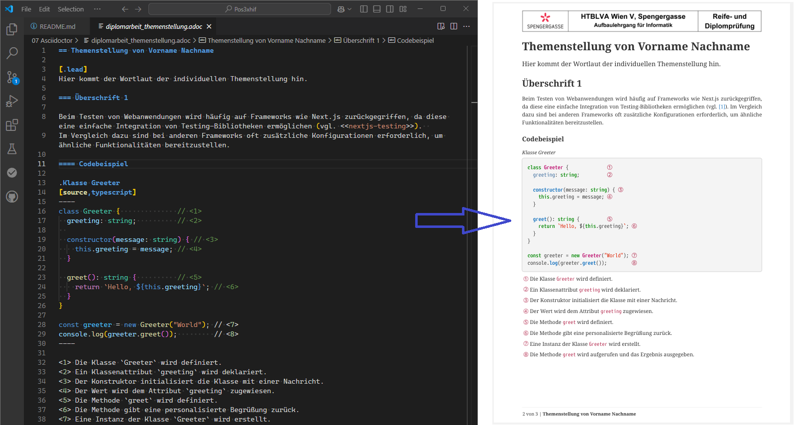

= Schreiben der Diplomarbeit mit AsciiDoc
ifndef::env-github[:icons: font]
ifdef::env-github[]
:caution-caption: :fire:
:important-caption: :exclamation:
:note-caption: :paperclip:
:tip-caption: :bulb:
:warning-caption: :warning:
endif::[]

Nachdem AsciiDoc installiert und lauffähig ist, kannst du auch deine *Diplomarbeit* mit AsciiDoc erstellen.
Es bietet mehrere Vorteile gegenüber Microsoft Word:

* Es ist ein textbasierendes Format.
  Daher kann es leicht unter Versionskontrolle in github gestellt werden.
* Quelltexte werden automatisch formatiert und können mit sog. _callouts_ kommentiert werden.
* Der Prozess des Zusammenfügens geschieht automatisch über _include_ Anweisungen.
* Das Layout ist zu 100% konsistent, auch von verschiedenen Autoren.

Lade das Paket *link:diplomarbeit_asciidoc.zip[diplomarbeit_asciidoc.zip]* herunter.
Es beinhaltet folgende Dateien:

Datei diplomarbeit_intro.docx::
Dies ist die von der Schule vorgegebene Vorlage für die ersten Seiten.
Sie beinhaltet das Titelblatt, die Eidesstattliche Erklärung und das Abstract in deutscher und englischer Sprache.
Fülle es aus und erzeuge ein PDF mit dem Namen *diplomarbeit_intro.pdf*.
+
WARNING: Achte auf die Kopfzeile.
Die Abteilung ist auf der ersten Seite und separat auf den weiteren Seiten zu setzen.
Achte auf das Schuljahr.

Datei diplomarbeit_gesamt.yml::
Dies ist der Stil für die PDF Umwandlung.
Er generiert die Seitennummern in der Fußzeile und fügt auch die Überschrift ein, damit gleich zu sehen ist, von wem der Inhalt kommt.
+
.diplomarbeit_gesamt.yml
[source,yml]
----
extends: default
page:
  margin: [25mm, 20mm, 20mm, 20mm]
  numbering:
    start-at: toc  
header:
  height: 25mm
  background-image: image:{header_image}[]
footer:
  recto:
    right:
      content: '*{chapter-title}* | {page-number} of {page-count}'
  verso:
    left:
      content: '{page-number} von {page-count} | *{chapter-title}*'
----

Datei diplomarbeit_gesamt.adoc::
Dies ist die Gesamtdatei, die mit `include` die einzelnen Themenstellungen lädt.
Beachte die Kommentare in dieser Datei.
+
TIP: Schließe die erzeugte PDF Datei _diplomarbeit_gesamt.pdf_ mit einer _.gitignore_ Datei aus.
Sonst entstehen merge Konflikte.

Datei diplomarbeit_themenstellung.adoc::
Dies ist die Vorlage für die individuellen Themenstellungen.
Kopiere sie am Besten für jeden im Team und füge den Nachnamen zum Dateinamen hinzu.
+
TIP: Erstelle für jeden im Team ein Unterverzeichnis und binde die Datei mit `include::(verzeichnis)/diplomarbeit_themenstellung.adoc[]` in _diplomarbeit_gesamt.adoc_ ein.
Die adoc Dateien haben meist externe Dateien wie Bilder, etc.
Dies erhält die Übersichtlichkeit im Repo.
