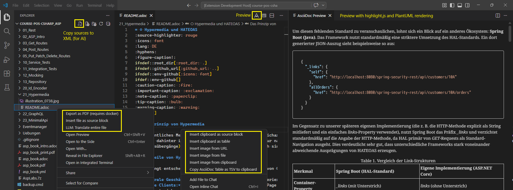
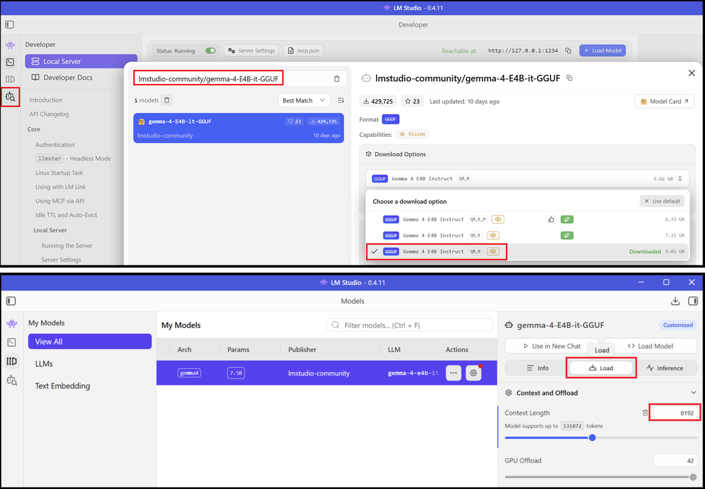

= AsciiDoc Productivity Extension
:source-highlighter: rouge
:icons: font
:lang: DE
:hyphens:
ifndef::env-github[:icons: font]
ifdef::env-github[]
:caution-caption: :fire:
:important-caption: :exclamation:
:note-caption: :paperclip:
:tip-caption: :bulb:
:warning-caption: :warning:
:folder: :file_folder:
:file-code-o: :page_facing_up:
endif::[]

Diese VS Code Extension ist ein Hilfsmittel, um das Schreiben von Dokumentationen, Arbeiten und Berichten in AsciiDoc massiv zu beschleunigen. Sie automatisiert das Einfügen von Quellcode, Tabellen und Bildern, sodass der Fokus auf dem Inhalt und nicht auf der Syntax liegt.

== Installation

Suche in den Erweiterungen nach `asciidoc-productivity` oder gehe zur Seite der Erweiterung im Marketplace unter https://marketplace.visualstudio.com/items?itemName=schletz.asciidoc-productivity.

== Features

Siehe link:asciidoc-productivity/README.md[README.md] der App.

=== LLM-Server für AI-Features

Die LLM-Funktionen „Translate“ und „Check spelling and grammar“ erfordern einen OpenAI-kompatiblen Endpunkt wie Ollama, vLLM etc.

==== Betrieb mit LM Studio

Installiere link:https://lmstudio.ai/[LM Studio].
Unter _Model search_ kannst du z. B. das Modell *lmstudio-community/gemma-4-E4B-it-GGUF* suchen.
Wähle das Modell in der Quantisierung _Q8_.
Stelle nach dem Download die _context length_ auf _8192 Token_.
1 Token ist etwa 3.5 Zeichen lang.
Das sind etwa 28.500 Zeichen für Text und Antwort.
Das bedeutet, du kannst damit ca. 14.000 Zeichen übersetzen.

Aktiviere dann im _Developer_-Bereich den Server.
Er stellt OpenAI-kompatible Endpunkte zur Verfügung.

Stelle dann in den Einstellungen von VS Code mittels _Preferences: Open User Settings (JSON)_ das Modell für die AI-Features ein:

[source,json]
----
"asciidoc-productivity.completionsUrl": "http://127.0.0.1:1234/v1/chat/completions",
"asciidoc-productivity.llm": "lmstudio-community/gemma-4-E4B-it-GGUF",
"asciidoc-productivity.maxOutputTokens": 4096,
----

[IMPORTANT]
Das Modell wird nach 4.096 Token in der Antwort aufhören.
Prüfe daher immer, ob der Inhalt nicht abgeschnitten wurde.
Für längere Texte kannst du den Wert _maxOutputTokens_ auf 8.192 erhöhen.
Dann musst du aber auch in den Einstellungen die _context length_ auf _16.384 Token_ erhöhen, da der Kontext aus System Prompt + Eingabetext + Antwort besteht.

=== Für neue NVIDIA-GPUs der 50er-Serie 💰💰💰

Wenn du eine neuere NVIDIA-Grafikkarte der 50er-Serie mit Blackwell-Architektur besitzt, die _NVFP4_ unterstützt, kannst du vLLM ganz einfach als Docker-Container mit einem spezialisierten Modell starten.

==== Download des Modells

Für die folgenden Befehle benötigen wir das CLI-Tool von Hugging Face.
Du kannst es mit folgendem Befehl in der Konsole herunterladen:

----
powershell -ExecutionPolicy ByPass -c "irm https://hf.co/cli/install.ps1 | iex"
----

Schließe danach die Konsole und öffne eine neue Konsole.
Der folgende Befehl lädt unser Modell in _%USERPROFILE%/.cache/huggingface_:_

----
hf download LilaRest/gemma-4-31B-it-NVFP4-turbo
----

Für manche Modelle ist der Befehl `hf login` nötig.
Hierfür musst du vorher auf https://huggingface.co einen Token generieren.

==== Starten des Containers

Wechsle in ein geeignetes Verzeichnis, z. B. _C:\vllm_.
Erstelle eine Datei namens _Dockerfile_ und füge den folgenden Inhalt ein:

.Dockerfile
[source,dockerfile]
----
FROM vllm/vllm-openai:cu130-nightly
RUN pip install --upgrade pandas
RUN pip install --upgrade "transformers>=5.5.0"
RUN pip install nvidia-modelopt[torch]
----

Erstelle anschließend eine Datei _create_vllm_gemma4_31b.cmd_ im selben Verzeichnis und füge den folgenden Inhalt ein:

.create_vllm_gemma4_31b.cmd
[source,text]
----
REM Check if Docker is running.
docker info >nul 2>&1
if %ERRORLEVEL% neq 0 (
    echo [ERROR] Docker does not seem to be running. Please start Docker and try again.
    pause
    exit /b 1
)

docker build -t my-vllm-gemma4 .
docker create --gpus all ^
  -v %USERPROFILE%/.cache/huggingface:/root/.cache/huggingface ^
  -p 8000:8000 ^
  --name vllm-gemma4 ^
  my-vllm-gemma4 ^
  --model LilaRest/gemma-4-31B-it-NVFP4-turbo ^
  --quantization modelopt ^
  --max-model-len 16384 ^
  --max-num-seqs 128 ^
  --max-num-batched-tokens 16384 ^
  --gpu-memory-utilization 0.9 ^
  --kv-cache-dtype fp8 ^
  --enable-prefix-caching ^
  --trust-remote-code
----

Nach dem Ausführen der cmd Datei kannst du in Docker Desktop den Container starten.
Überprüfe das Docker-Log, um sicherzustellen, dass der Container bereit ist (die Meldung _Application startup complete_ erscheint).
Dies kann einige Minuten dauern, da beim Starten Optimierungen durchgeführt werden.

[WARNING]
Dies ist ein nightly Build des vLLM Servers.
Einstellungen können sich jederzeit ändern.
Prüfe daher nach dem Anlegen des Containers im Log, ob dieser auch startet.

==== Anpassen der Einstellungen der Extension

Stelle dann in den Einstellungen von VS Code mittels _Preferences: Open User Settings (JSON)_ das Modell für die AI-Features ein:

[source,json]
----
"asciidoc-productivity.completionsUrl": "http://127.0.0.1:8000/v1/chat/completions",
"asciidoc-productivity.llm": "LilaRest/gemma-4-31B-it-NVFP4-turbo",
"asciidoc-productivity.maxOutputTokens": 8192,
----

Mit einer RTX 5090 ist ein Wert von etwa 45 Tokens pro Sekunde zu erwarten.