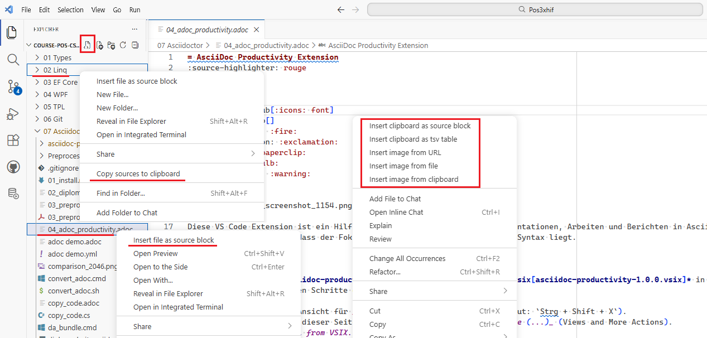

= AsciiDoc Productivity Extension
:source-highlighter: rouge
:icons: font
:lang: DE
:hyphens:
ifndef::env-github[:icons: font]
ifdef::env-github[]
:caution-caption: :fire:
:important-caption: :exclamation:
:note-caption: :paperclip:
:tip-caption: :bulb:
:warning-caption: :warning:
:folder: :file_folder:
:file-code-o: :page_facing_up:
endif::[]

Diese VS Code Extension ist ein Hilfsmittel, um das Schreiben von Dokumentationen, Arbeiten und Berichten in AsciiDoc massiv zu beschleunigen. Sie automatisiert das Einfügen von Quellcode, Tabellen und Bildern, sodass der Fokus auf dem Inhalt und nicht auf der Syntax liegt.

== Installation

Lade die Datei *link:asciidoc-productivity/asciidoc-productivity-1.0.0.vsix[asciidoc-productivity-1.0.0.vsix]* in einen Ordner auf deiner Festplatte.
Führe danach die folgenden Schritte durch:

1. Öffne in VS Code die Ansicht für _Erweiterungen / Extensions_ (Shortcut: `Strg + Shift + X`).
2. Klicke oben rechts in dieser Seitenleiste auf die _drei kleinen Punkte (...)_ (Views and More Actions).
3. Wähle im Menü _Install from VSIX..._ (Aus VSIX installieren...).
4. Wähle die gerade erstellte `.vsix`-Datei aus deinem Ordner aus.

Die Extension ist aktiv, sobald du eine `.adoc` Datei öffnest.

== Features

Diese Extension bietet verschiedene Werkzeuge, die du alle über das _Rechtsklick-Menü (Kontextmenü)_ aufrufen kannst. 

=== 1. Quellcode aus der Zwischenablage einfügen (Insert as source block)
Kopiere einen beliebigen Code. Mache einen Rechtsklick in dein AsciiDoc-Dokument und wähle `Insert as source block`. 
Es öffnet sich oben eine Eingabezeile, in der du die Programmiersprache (z. B. `csharp`, `java`, `python`) eintippen kannst. Der Code wird dann perfekt formatiert als AsciiDoc-Source-Block eingefügt.

=== 2. TSV-Tabellen einfügen (Insert as tsv table)
Kopiere tabellenartige Daten (z. B. direkt aus Excel) in deine Zwischenablage. Wähle im Rechtsklick-Menü `Insert as tsv table`. 
Die Extension erkennt automatisch die Anzahl der Spalten (anhand der Tabulatoren) und generiert einen fertigen AsciiDoc-Tabellen-Block im TSV-Format.

=== 3. Bild aus lokaler Datei einfügen (Insert image from file)
Du möchtest ein Bild einbinden, das auf deiner Festplatte liegt? Wähle `Insert image from file`. 
Ein Dialogfenster öffnet sich im aktuellen Ordner. Wähle dein Bild aus. Die Extension berechnet vollautomatisch den _relativen Pfad_ von deinem Dokument zum Bild und fügt die korrekte `image::pfad/zum/bild.png[]` Syntax ein.
Hinweis: Damit der Pfad zur adoc Datei passt, muss du sie zuerst speichern.

=== 4. Bild aus der Zwischenablage speichern (Insert image from clipboard)
Du hast einen Screenshot gemacht und er liegt in deiner unsichtbaren Zwischenablage? 
Wähle `Insert image from clipboard`. Ein Speichern-Dialog öffnet sich. Gib dem Bild einen Namen. Die Extension speichert das Bild aus dem Arbeitsspeicher auf deine Festplatte und fügt den Code mit dem relativen Pfad sofort ins Dokument ein.
Hinweis: Damit der Pfad zur adoc Datei passt, muss du sie zuerst speichern.

=== 5. Bild aus dem Internet herunterladen (Insert image URL)
Kopiere die URL eines Bildes (z. B. `https://beispiel.de/bild.png`) in die Zwischenablage. Wähle `Insert image URL`. 
Die Extension lädt das Bild aus dem Internet herunter, fragt dich, wo du es lokal abspeichern möchtest, und fügt es dann mit der Angabe der ursprünglichen Quelle ins Dokument ein. So gehen keine Bilder verloren, falls die Website später offline geht.
Hinweis: Damit der Pfad zur adoc Datei passt, muss du sie zuerst speichern.

=== 6. AsciiDoc Tabelle als TSV in die Zwischenablage kopieren
Markiere eine Tabelle in AsciiDoc mit dem Start- und Endzeichen (_|===_).
Im Kontextmenü gibt es den Punkt _Copy AsciiDoc Table as TSV to clipboard_.
Er kopiert die Tabelle als Tab getrennte Tabelle in die Zwischenablage.
Diese Daten können dann z. B. in Excel eingefügt werden.

=== 7. Datei direkt als Code-Block importieren (File Explorer Feature)
Das ist das mächtigste Feature für Programmierer: 
Gehe in der _linken Dateibaum-Ansicht_ von VS Code (File Explorer) auf eine Code-Datei (z. B. `.cs`, `.java`, `.py`). Mache einen Rechtsklick _auf die Datei_ und wähle `Insert as source block`. 
Die Extension liest die komplette Datei ein, erkennt die Programmiersprache automatisch, berechnet den relativen Pfad und fügt in deinem aktuell geöffneten AsciiDoc-Dokument einen klickbaren Link zur Datei samt dem Quellcode ein.
Hinweis: Damit der Pfad zur adoc Datei passt, muss du sie zuerst speichern.

=== 8. Dateien eines Verzeichnisses in die Zwischenablage kopieren
Gerade für KI Prompts wird der Source Code im Contextwindow benötigt.
Beim Klicken auf ein *Verzeichnis* im File Explorer erscheint ein Menüpunkt _Copy sources to clipboard_.
Wenn du den aktuellen Ordner kopieren möchtest, kannst du im Explorer auf den Button neben dem Verzeichnisnamen klicken (siehe Screenshot).
Achte beim Prompten, ob auch der ganze Code kopiert wurde.
Gerade im Free Plan ist das Contextwindow nur sehr begrenzt.

==== Konfiguration

Vor jedem Start fragt die App, welche Erweiterungen berücksichtigt werden sollen.
Die Vorbelegung wird aus der Datei _settings.json_ gelesen (_includeExtensions_).

Für die Erweiterungen _docx_ und _pdf_ ist ein Extraktor vorhanden (_mammoth_ für Worddateien, _pdfreader_ für PDF Dateien).
Um auch diese Dateien zu kopieren, musst du die Erweiterungen _docx_ und _pdf_ in den Einstellungen hinzufügen bzw. vor dem Kopieren eingeben.

Es werden keine Dateien gelesen, die über 10 MB groß sind.

Die folgenden Einstellungen können in der _settings.json_ Datei gesetzt werden (Beispiele):

[source,json]
----
"asciidoc-productivity.includeExtensions": "cs|csproj|java|rb|json|js|ts|jsx|tsx|py|txt|xml|adoc|md|cmd|sh|sql|yaml|puml",
"asciidoc-productivity.excludeDirectories": ["bin", "obj", "node_modules", "TestResults"],
"asciidoc-productivity.excludeFiles": ["package-lock.json"],
----

== Erweitern und Erstellen der VSIX Datei

Im Verzeichnis link:asciidoc-productivity[asciidoc-productivity] befindet sich der Quelltext.

package.json::
Definiert im Key _contributes_ die Menüeintrage und verweist auf die Methoden in der Extension.

src/extension.ts::
Die eigentliche Extension.
Sie wird zu Beginn geladen.
Bei einem Klick auf das Menü wird die entsprechende Methode aufgerufen.

src/EditorService.ts::
Um die Methoden des Editors zusammenzufassen, gibt es hier eine klassische Servicedatei.

src/ConfigurationService.ts::
Liest die Konfiguration aus der Datei _settings.json_ und stellt diese der Applikation bereit.

=== Testen

Wenn du mit _Open Folder_ das Verzeichnis der Extension öffnest, kannst du einfach mit _F5_ oder _Run -> Start Debugging_ ein VS Code Fenster öffnen und deine Extension zuerst einmal testen.

=== Exportieren in eine VSIX Datei

Um die Extension selbst zu bauen und in Visual Studio Code (VS Code) zu installieren, wird das globale Node.js Tool _@vscode/vsce_ benötigt.
Du kannst es mit `npm install -g @vscode/vsce` in der Konsole installieren.
Gehe nun in den Ordner der Extension (dort, wo die `package.json` liegt).
Führe dann folgenden Befehl aus, um die fertige Installationsdatei zu generieren:

[source,bash]
----
vsce package --allow-missing-repository
----

Nach dem Durchlauf findest du in deinem Ordner eine neue Datei mit der Endung `.vsix` (z. B. `asciidoc-productivity-1.0.0.vsix`).
Diese kannst du nun in VS Code installieren.
