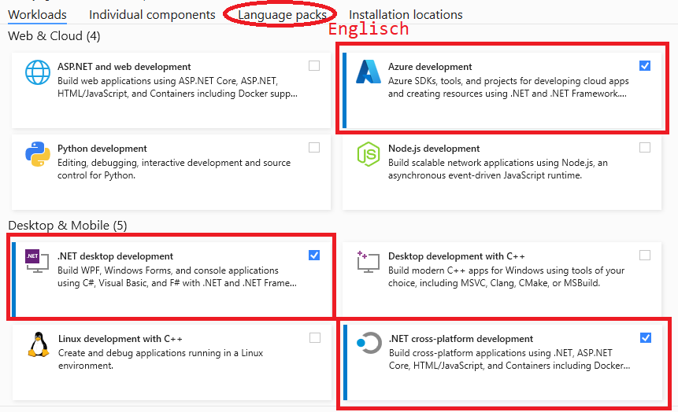

# Installation der IDE

## Visual Studio 2019

### Download der Installationsdateien

Der Installer kann von der [Visual Studio Installationsseite](https://visualstudio.microsoft.com/de/downloads/)
heruntergeladen werden. Wähle die *Enterprise* Version, da die Schule eine Lizenz hierfür von Microsoft
hat. Der Key wird im Unterricht bekannt gegeben.

### Auswählen der Komponenten

Wenn der Speicher auf der SSD knapp wird, kann die Software
[PatchCleaner](https://sourceforge.net/projects/patchcleaner/) alte Windowsinstallationen,
die als Backup bei Windows Updates erhalten bleiben, entfernen. Nach dem 
Starten des Installers können die Komponenten ausgewählt werden.

**Workloads:** (1) .NET Entwicklung, (2) Plattformübergreifende .NET Core Entwicklung. Unter
*Sprachpakete* wähle *Englisch* statt Deutsch.


### Freischaltung

Unter *Help* - *Register Product* kann der Produktkey der Schule eingegeben werden.

## Optional: Produkte von JetBrains

Jetbrains bietet 2 Produkte für die .NET Entwicklung an: ReSharper ist eine Erweiterung für Visual
Studio. Rider ist ein eigenständiges Programm für die Entwicklung von .NET Programmen.

Aus https://intranet.spengergasse.at/news/jetbrains-produkte-in-den-laboren-und-auf-den-laptops-von-studierenden-und-lehrkraeften/:
> In enger Zusammenarbeit mit dem ZID (herzlichen Dank hierfür) ist es uns gelungen den von der
> Firma JetBrains zur Verfügung gestellten Lizenzserver für unsere Labor-Rechner aufzusetzen.
>
> Wir haben nun die Möglichkeit bis zu 300 Laborrechner nicht nur mit IntelliJ sondern vielmehr mit
> sämtlichen Produkten des Herstellers auszustatten. An den aktualisierten Images wird seitens des
> ZID gearbeitet.
>
> Selbstverständlich können sowohl Studierende als auch Lehrkräfte eine individuelle Lizenz über alle
> Produkte für den persönlichen Laptop auf der [JetBrains Registrierungsseite](https://www.jetbrains.com/student/) 
> mit einer @spengergasse.at eMail beantragen. Diese Lizenz läuft wie immer ein Jahr und kann solange man eine @spengergasse.at
> eMail Adresse hat, verlängert werden.

Nach der Registrierung können die beliebtesten Produkte von https://account.jetbrains.com/licenses/assets
geladen werden:


## Visual Studio Code (VS Code) zum Erstellen von Markdown (md) Dateien und Plant UML Diagrammen.

Markdown Dateien mit UML Diagrammen können am Besten mit VS Code erstellt werden.

1. Installiere [Visual Studio Code](https://code.visualstudio.com). Wichtig: Aktiviere beim
   Setup die Integration von VS Code in das Ordner Kontextmenü. Dadurch kann mit Rechtlick ein
   Ordner aus dem Explorer aus in VS Code geöffnet werden.
2. Installiere die folgenden Extensions:
   - Markdown PDF
   - Markdown Preview Enhanced
   - PlantUML
3. Öffne die VS Code Konfiguration (*F1* - "*settings*" eingeben - "*Preferences: Open Settings (JSON)*" wählen)
   und füge folgende Zeilen hinzu:

```javascript
    "markdown-pdf.plantumlOpenMarker": "```plantuml\n@startuml",
    "markdown-pdf.plantumlCloseMarker": "```"   
```

Nun steht durch die Extension *Markdown Preview Enhanced* ein Icon bereit, welches eine Vorschau mit
dem gerenderten Diagramm bietet.
