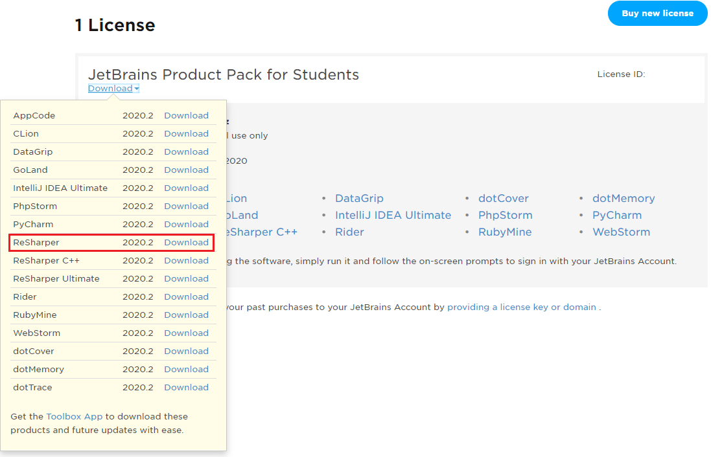

# Installation der IDE

## Visual Studio 2019

### Download der Installationsdateien

Der Installer kann von der [Visual Studio Installationsseite](https://visualstudio.microsoft.com/de/downloads/)
heruntergeladen werden. Wähle die *Enterprise* Version, da die Schule eine Lizenz hierfür von Microsoft
hat. Der Key wird im Unterricht bekannt gegeben.

### Auswählen der Komponenten

Es sollten rund 20 GB Platz auf der Festplatte für die folgenden Komponenten sein. Wenn der Speicher auf
der SSD knapp wird, kann die Software [PatchCleaner](https://sourceforge.net/projects/patchcleaner/)
alte Windowsinstallationen, die als Backup bei Windows Updates erhalten bleiben, entfernen. Nach dem 
Starten des Installers können die Komponenten ausgewählt werden.

**Workloads:** (1) .NET Entwicklung, (2) ASP.NET Entwicklung, (3) Mobile Entwicklung (für die 4. Klasse), 
(4) Plattformübergreifende .NET Core Entwicklung, (5) Universal WIndows Platform development


**Einzelne Komponenten:** Zusätzlich wird Klassen-Designer angewählt, um die Klassenmodelle öffnen zu
können. Sonst wird nur eine XML Datei angezeigt.


**Sprachpakete:** Da es zu deutschen Fehlermeldungen auf Google wenig geben wird, und die Übersetzungen
manchmal sehr kreativ sind, wähle hier Englisch als Sprache.


### Freischaltung
Unter *Help* - *Register Product* kann der Produktkey der Schule eingegeben werden.

## JetBrains ReSharper

Aus https://intranet.spengergasse.at/news/jetbrains-produkte-in-den-laboren-und-auf-den-laptops-von-studierenden-und-lehrkraeften/:
> In enger Zusammenarbeit mit dem ZID (herzlichen Dank hierfür) ist es uns gelungen den von der
> Firma JetBrains zur Verfügung gestellten Lizenzserver für unsere Labor-Rechner aufzusetzen.
>
> Wir haben nun die Möglichkeit bis zu 300 Laborrechner nicht nur mit IntelliJ sondern vielmehr mit
> sämtlichen Produkten des Herstellers auszustatten. An den aktualisierten Images wird seitens des
> ZID gearbeitet.
>
> Selbstverständlich können sowohl Studierende als auch Lehrkräfte eine individuelle Lizenz über alle
> Produkte für den persönlichen Laptop auf der [JetBrains Registrierungsseite](https://www.jetbrains.com/student/) 
> mit einer @spengergasse.at eMail beantragen. Diese Lizenz läuft wie immer ein Jahr und kann solange man eine @spengergasse.at
> eMail Adresse hat, verlängert werden.

Nach der Registrierung können die beliebtesten Produkte von https://account.jetbrains.com/licenses/assets
geladen werden:



## Visual Studio Code

.NET Core Projekte können auch in Visual Studio Code erstellt werden. Nach dem Download von
https://code.visualstudio.com/ sind 2 Extensions für die C#/ASP.NET Core Entwicklung erforderlich
bzw. ratsam:

[C#](https://marketplace.visualstudio.com/items?itemName=ms-dotnettools.csharp)
[Awesome DotNetCorePack](https://marketplace.visualstudio.com/items?itemName=salbert.awesome-dotnetcore-pack)

Eine .NET Core Applikation kann im Terminal direkt erstellt werden:

```text
Path>md MyProjektName
Path>cd MyProjektName
Path>dotnet new console
```

> **Hinweis:** Öffnen Sie Ihr Projekt mit *File* - *Open Folder* und nicht nur die *.cs* Datei alleine.

