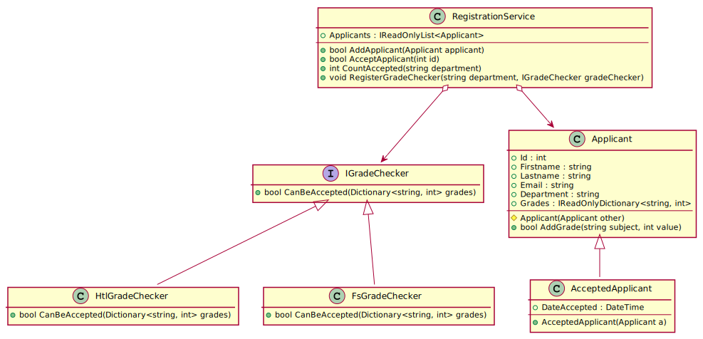

# Ein Anmeldesystem

Im November beginnen die Bewerbungen für interessierte Schülerinnen und Schüler
der 4. Klasse um einen Schulplatz an unserer Schule. Dabei werden die Daten von den
Bewerbern in ein Aufnahmesystem eingegeben.

Nach der Eingabe der Noten entscheidet der Abteilungsvorstand, wer aufgenommen wird.

Es gibt gesetzliche Vorschriften, welche Noten ein Bewerber für einen Schultyp haben muss
(HTL oder Fachschule). Werden diese nicht erfüllt, muss eine Aufnahmeprüfung gemacht werden.

Folgendes Modell soll diesen Sachverhalt vereinfacht wiedergeben:

https://www.plantuml.com/plantuml/uml/hPBTxjem3CNl-nIMTWE2li2440p6XeGqYUq5J68WMvfMYOk4sDvz_MX2K-1_1JVKpl7fyQzPE4RBPQQJiv84b1LyXQCYBLsI28tEmR8ej19e699R0jLlifNm6PJXjjeewzXWHbNJiLNcrFPt-BJzDKEb1xqr5MWv8yE3WsyM9RcgkTqJoXz6NzTAiCeDskki5Kxh9FD6dgPfy_yfH1w59yZvJ7RSsXxoNCDIoiP-rFg0Am-_IN3Z1nVK9OsJVm6245GmoU3dMQoHgJkigTJbBvLHb6SIJyUvi7dBWmBIiaZ_pk_qVP8zdLIL66iAFybUb22V9MWZOhjAFWj7CQb0ucao_zIZre6uosjOIdQAkbZbfM6_ZcSh_GVsNfTSoMuLiirdM9r9_27xE365RLy0frxHi7j21F8qdSTphsGHuce1iaSKD9YzzGYiq7oXiE2B-zYcT6E0-ntwplhzfXltJiz1H7y9OnZ-bHzf5cHacUd_

## Klassenbeschreibung

#### Interface IGradeChecker
Der Grade Checker beinhaltet die Methode *CanBeAccepted()*, die feststellt, ob ein Bewerber
aufgrund der Noten aufgenommen werden darf. Sie liefert true, wenn der Bewerber aufgenommen werden
darf, false wenn nicht.

#### Klasse HtlGradeChecker
Prüft, ob eine Aufnahme in eine HTL ohne Prüfung erfolgen darf. Die echte Regelung berücksichtigt
noch die Schulart, dies ist eine Vereinfachung.

- **CanBeAccepted()** liefert true, wenn alle übergebenen Noten besser als 4 sind
  (also den Wert 1, 2, oder 3 haben).

#### Klasse FsGradeChecker
Prüft, ob eine Aufnahme in eine Fachschule ohne Prüfung erfolgen darf. Die echte Regelung
berücksichtigt noch die Schulart, dies ist eine Vereinfachung.

- **CanBeAccepted()** liefert true, wenn alle übergebenen Noten positiv sind
  (also den Wert 1, 2, 3 oder 4 haben).

#### Klasse Applicant
Erfasst den Bewerber mit den Stammdaten. Es ist ein Konstruktor für alle Werte zu definieren.
Die Properties selbst sind immutable.

- **Applicant(Applicant other)** ist ein Copykonstruktor. Er muss protected sein und weist einfach
  alle Felder von other den eigenen Werten zu.
- **AddGrade()** fügt die Note zum internen Dictionary hinzu. Liefert false, wenn die Note schon
  existiert. Ansonsten true.

#### Klasse AcceptedApplicant
Stellt einen akzeptierten Bewerber dar, der einen Schulplatz bekommen hat.

- **AcceptedApplicant()** Überträgt die Daten des übergebenen
  Bewerbers und setzt *DateAccepted* auf die Systemzeit (*DateTime.UtcNow*). Dabei wird der
  Copykonstruktor von *Appicant* verwendet.

#### Klasse RegistrationService
Ist das Service zur Registrierung der Bewerber und für alle Methoden
da, die die Bewerbungen bearbeiten.

- **RegisterGradeChecker()**  Fügt die übergebene Instanz eines
  GradeCheckers zu einem internen Dictionary hinzu. Das Dictionary
  soll den Typ *Dictionary&lt;string, IGradeChecker&gt;* haben.
- **AddApplicant()** Fügt den übergebenen Bewerber zur internen Liste
  hinzu.
- **AcceptApplicant()** Sucht nach der übergebenen ID in der Liste der
  Bewerber und setzt den Status auf aufgenommen: 
  - Liefert false, wenn die ID nicht existiert. 
  - Ist der Bewerber schon aufgenommen (der Eintrag ist ein 
    *AcceptedApplicant*), wird false geliefert. 
  - Danach wird der entsprechende GradeChecker im Dictionary
    für die Abteilung des Bewerbers gesucht. 
  - Liefert die Methode *CanBeAccepted()* des GradeCheckers false, wird 
    false geliefert.
  - Existiert kein GradeChecker, so wird die Prüfung ausgelassen.
  - Am Ende wird der Bewerber durch eine neu erzeugte Instanz von
    *AcceptedApplicant* ersetzt.  Hinweis: Verwende Remove() zum Entfernen 
    des alten Bewerbers aus der Liste und füge dann den neu erstellten
    aufgenommenen Bewerber hinzu.
- **CountAccepted()** Liefert zurück, wie viele Bewerber einer Abteilung
  den Status "aufgenommen" (also *AcceptedApplicant*) haben.