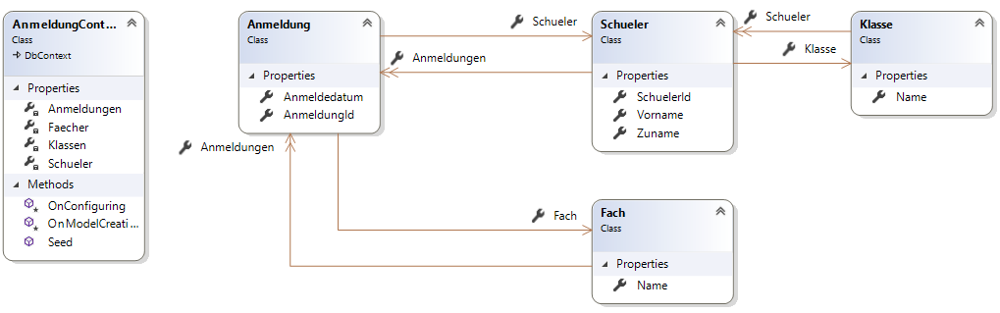
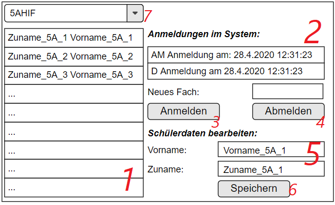

# Übung zu WPF und EF Core: Anmeldesystem

## Intro

Ab 4. Mai besuchen die 5. Klassen sogenannten Ergänzungsunterricht als Vorbereitung für die Matura.
Für diesen Unterricht musste sich jeder anmelden. Die Aufgabenstellung umfasst eine kleine WPF
Applikation, die diese Anmeldung abbilden soll.

Eine Visual Studio Solution wird in der Datei [Anmeldesystem.zip](Anmeldesystem.zip) zur Verfügung gestellt. Entpacke
sie und benenne den Ordner *ACC1234* auf deinen Accountnamen um.

## Datenbank

Die Modelklassen sind im Ordner *Model* definiert. Sie implementieren das dargestellte
Klassendiagramm:



In der Klasse *AnmeldungContext* sind bereits die DbSet Properties
und die Methode *OnConfiguring()* vorhanden. Diese Methode erzeugt eine SQLite Datenbank mit
dem Namen *Anmeldungen.sb*, die im Ausgabeordner (*bin/Debug/netcoreapp3.1*) angelegt wird.

Allerdings ist die Methode *OnModelCreating()* noch leer. Implementiere diese Methode so, dass
folgende Constraints beim Erstellen der Datenbank verwendnet werden:

- Die Tabellen für die Klassen *Fach, Klasse, Schueler und Anmeldung* sollen ebenfalls
  *Fach, Klasse, Schueler und Anmeldung* heißen. Standardmäßig wird der Name des Properties vom Typ
  DbSet Verwendet. Hinweis: Die Anweisung `modelBuilder.Entity<X>().ToTable("Y");` weist der
  Modelklasse X den Tabellenname Y zu.
- In der Tabelle *Fach* ist der Primärschlüssel das Property *Name*. Die maximale Länge soll 16 Zeichen
  betragen. Hinweis: Es sind 2 getrennte Anweisungen für die Definition des Primärschlüssels und
  dem Einstellen der Länge zu verwenden.
- In der Tabelle *Klasse* ist der Primärschlüssel das Property *Name*. Die maximale Länge soll 16 Zeichen
  betragen.
- In der Tabelle *Schueler* sind die Properties *Vorname* und *Zuname* verpflichtend (NOT NULL) und
  sollen maximal 255 Zeichen lang sein. Außerdem ist das Property Klasse verpflichtend (NOT NULL).
  Hinweis: Arbeite mit `HasOne(s => s.Klasse).WithMany(k => k.Schueler).IsRequired()`, da es sich um
  ein Navigation Property handelt.
- In der Tabelle *Anmeldung* sind die Properties *Schueler* und *Fach* verpflichtend (NOT NULL).

### Erzeugen der Datenbank

Im Konstruktor der Klasse *MainWindow* ist bereits Code vorhanden, der die
Datenbank aus den Modelklassen erstellt:

```c#
using (AnmeldungContext db = new AnmeldungContext())
{
    // Bei Änderungen im Modell oder zum Zurücksetzen der DB ist
    // db.Database.EnsureDeleted();
    // zu aktivieren.
    if (db.Database.EnsureCreated()) { db.Seed(); }
}
```

Wenn die Datenbank zurückgesetzt werden soll, dann muss der Kommentar vor dem Aufruf von
`db.Database.EnsureDeleted();` entfernt werden.

## Umsetzung der Benutzeroberfläche

Die folgende Grafik zeigt ein Mockup der Benutzeroberfläche. Sie muss nicht exakt so umgesetzt
werden, Positionierung und Aussehen sind frei wählbar.



## Anforderungen, Beurteilungskriterien

Nachfolgend befinden sich die Anforderungen, die an das Programm gestellt werden. Arbeite sie
in genau dieser Reihenfolge ab, damit alle Basisanforderungen erfüllt werden. Wenn diese Übung
im Rahmen einer praktischen Leistungsfeststellung benotet werden würde, ist die dazugehörige
Note ebenfalls angegeben. Die beschriebene Note kann nur dann gegeben werden, wenn alle
darunterliegenden Anforderungen ebenfalls erfüllt werden.

### Genügend

- Beim Starten der Applikation wird die Liste der Schüler (1) mit allen Schülern der Tabelle
  *Schueler* gefüllt. Es ist dabei der Zu- und Vorname anzuzeigen. Die Filterung mit dem
  dropdown Menü (7) ist hier **nicht** notwendig.
- Wird ein Schüler ausgewählt, so wird die Liste der Anmeldungen (2) mit den Anmeldungen des aktiven
  Schülers befüllt. Dabei ist das Fach und das Anmeldedatum anzuzeigen. Die Formatierung der Liste ist
  frei, solange diese 2 Informationen angezeigt werden.
- Beim Klick auf *Anmelden* (3) wird das im Feld *Neues Fach* eingetragene Fach eingefügt. Als
  Datum wird das aktuelle Systemdatum geschrieben (*Datetime.Now*) Ein
  sofortiges Aktualisieren der Liste der Anmeldungen ist **nicht** notwendig.
- Beim Klick auf *Abmelden* (4) wird die ausgewählte Anmeldung aus der Datenbank gelöscht. Ein
  sofortiges Aktualisieren der Liste der Anmeldungen ist **nicht** notwendig.

### Befriedigend

- Die Liste der Anmeldungen wird als *ObservableCollection* umgesetzt. Dabei wird bei einer Änderung
  (Hinzufügen oder Löschen einer Anmeldung) die Liste sofort aktualisiert.
- Die Felder für Vor- und Zuname (5) werden mit dem aktiven Schüler befüllt. Ein Klick auf
  *Speichern* (6) speichert eine eventuelle Änderung dieser Werte in der Datenbank und aktualisiert
  die Liste.

### Gut

- Über der Liste der Schüler wird mit einem dropdown Menü (Control *ComboBox*) die Liste der
  eingetragenen Klassen angezeigt. Beim Wählen einer Klasse werden nur die Schüler dieser
  Klasse angezeigt. Beim Start der Applikation wird das erste Element vorausgewählt.
- Es dürfen in keinem Zustand Laufzeitfehler auftreten, die nicht behandelt werden (try/catch oder
  Validator). Teste auch die Buttons, wenn kein Schüler bzw. Anmeldung gewählt wurde oder ungültige
  Werte eingetragen wurden.

### Sehr gut

- Beim Eintragen einer Anmeldung wird geprüft, ob schon eine Anmeldung des Schülers für das Fach
  besteht. So sollen Doppelanmeldungen vermieden werden.
- Wird ein ungültiges Fach eingegeben, wird mit einem Validator die Meldung "ungültiges Fach"
  im Textfeld ausgegeben. Hinweis: Erstelle im ViewModel ein eigenes Proeprty, an das das Feld
  gebunden ist. Im set wird dann eine *ArgumentException* geworfen, wenn das Fach nicht vorkommt.

## Abgabe

Schließe Visual Studio und führe die Datei *cleanSolution.cmd* aus. Sie entfernt alle Builds. Gib nun
den Ordner mit dem Accountnamen als ZIP Datei ab (Rechtsklick im Explorer auf den Ordner mit deinem
Accountnamen, *Senden an* und *ZIP komprimierter Ordner*). Die ZIP Datei soll *(Accountname).zip*
heißen. Lade diese Lösung auf Teams hoch.

## Weitere Informationen

Unter https://github.com/schletz/Pos3xhif/tree/master/04%20WPF/05_EF_Core ist in der
Datei *EfCoreLoesung20200430.zip* eine vollständig entwickelte Lösung vorhanden.
