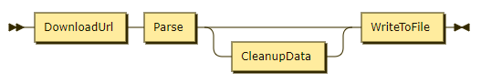

# Fluent API

In neuen Klassen des .NET Core Frameworks - gerade im ASP.NET Core Bereich - findet sich immer
häufiger die Umsetzung einer sogenannten *Fluent API*. Dies ist eine Technik, bei der
Methodenaufrufe hintereinander gesetzt werden.

Ein Beispiel dafür ist LINQ, wo *Where()*, *Select()*, ... verkettet werden können. Wenn wir z. B.
einen Downloader schreiben, der die heruntergeladenen Daten parsen und in eine Datei schreiben kann,
könnte folgender Aufbau umgesetzt werden:

```c#
Downloader.DownloadUrl("http://mysite.at")
    .Parse()
        .CleanupData()
    .WriteToFile("xxx.json");
```

## 1. Ansatz: Instanz wird zurückgegeben

Bereits mit Techniken aus der 1. Klasse kann das obige Beispiel syntaktisch realisiert werden. Jede
Methode liefert einfach *this* zurück. Nur *WriteToFile* ist eine *void* Methode, da sie als
letzte Methode aufgerufen werden muss.

```c#
class Downloader
{
    private Downloader() { }               // Private Konstruktor verhindert Instanzierung von außen

    public static Downloader DownloadUrl(string url)
    {
        Downloader downloader = new Downloader();
        // ...
        return downloader;
    }

    public Downloader CleanupData() { /* Do something */ return this; }

    public Downloader Parse() { /* Do something */ return this; }

    public void WriteToFile(string filename) { /* Do something */ }
}
```

Allerdings sind jetzt auch folgende Aufrufe möglich:

```c#
Downloader.DownloadUrl("http://mysite.at")
    .CleanUpData()
    .Parse()
```

Das macht natürlich keinen Sinn, denn erst nach dem Parsen können z. B. überflüssige Daten
entfernt werden. Die Methoden müssten daher immer prüfen, in welchen Zustand (State) die Instanz
gerade ist. Bei einer falschen Reihenfolge wird eine Exception geliefert, welche aber erst zur
Laufzeit auftritt.

Besser ist natürlich eine Lösung, bei der nach *DownloadUrl()* nur die *Parse()* Methode zur Verfügung
steht. Somit ist schon beim Kompilieren und in IntelliSense die richtige Reihenfolge sichergestellt.

## 2. Ansatz: Interfaces legen die erlaubten Methoden fest

Wir möchten sicherstellen, dass die Methoden nur in einer gewissen Reihenfolge aufgerufen werden
können. Dieses railroad diagram zeigt die erlaubten Aufrufe:



Das Verhalten können wir auch bereits mit einfachen Mitteln aus der objektorientierten Programmierung
umsetzen: Der Rückgabetyp der einzelnen Methoden ist nicht der Downloader, sondern ein spezielles
Interface, welches die erlaubten Methoden für den nächsten Schritt festlegt.

Die Klasse Downloader implementiert alle Interfaces. Da sie durch den *private* Konstruktor nicht
direkt instanziert werden kann, ist sichergestellt, dass die Methoden nicht direkt aufgerufen werden
können.

Die Implementierung sieht dann so aus:

```c#
interface IAfterParse
{
    IAfterParse CleanupData();
    void WriteToFile(string filename);
}

interface IAfterDownload
{
    IAfterParse Parse();
}

class Downloader : IAfterDownload, IAfterParse
{
    private Downloader() { }               // Private Konstruktor verhindert Instanzierung von außen

    public static IAfterDownload DownloadUrl(string url)
    {
        Downloader downloader = new Downloader();
        // ...
        return downloader;
    }

    public IAfterParse CleanupData() { /* Do something */ return this; }

    public IAfterParse Parse() { /* Do something */ return this; }

    public void WriteToFile(string filename) { /* Do something */ }
}
```

Nun kann - da *DownloadUrl()* den Typ *IAfterDownload* liefert - nicht direkt die Methode *CleanupData()*
oder *WriteToFile()* aufgerufen werden. Das Interface *IAfterParse* definiert 2 Methoden, denn nach
dem Parsevorgang kann entweder *WriteToFile()* oder *CleanupData()* aufgerufen werden.

## Kombination mit Extension Methods

Nun wollen wir eine Methode *Log()* bereitstellen, die immer aufgerufen werden kann.

```c#
Downloader
    .DownloadUrl("http://mysite.at")
    .Log()                        // Log darf immer aufgerufen werden.
    .Parse()                      // Darf nur nach DownloadUrl aufgerufen werden.
        .CleanupData()            // Darf nur nach Parse aufgerufen werden.
        .Log()
    .WriteToFile("xxx.json");     // Darf nur nach Parse oder CleanupData aufgerufen werden.
```

Dieser Wunsch ist allerdings nur auf den ersten Blick leicht zu erfüllen. Nach unserem vorigen 
Ansatz haben wir 2 Möglichkeiten:

- Wir definieren die Methode *Log()* in jedem Interface.
- Wir erstellen ein Interface *IDownloader* für alle Methoden, die überall aufgerufen werden können.

Der erste Ansatz klingt zwar einfach, hat aber folgendes Problem: Im Interface *IAfterDownload* müsste
*Log()* *IAfterDownload* zurückgeben. Im Interface *IAfterParse* müsste die *Log()* Methode *IAfterParse*
zurückgeben, damit sie entsprechend eingebaut werden kann.

Dies führt zu sehr schlechtem (kopiertem) Code, da ja auch die Methoden unterschiedlich sind. Also
erstellen wir ein Interface *IDownloader* mit der *Log()* Methode:

```c#
interface IDownloader
{
    byte[] Data { get; }    // Class members used in Downloader
    ??? Log()               // Was liefert Log nun zurück?
}

interface IAfterParse : IDownloader
{
    IAfterParse CleanupData();
    void WriteToFile(string filename);
}

interface IAfterDownload : IDownloader
{
    IAfterParse Parse();
}
```

Jetzt haben wir das Problem des Rückgabetyps von Log() nur verschoben. Schließlich muss diese Methode
manchmal *IAfterParse* und manchmal *IAfterDownload* liefern, je nach dem wo sie eingesetzt wird.

Daher müssen wir das Problem allgemeiner (generisch) formulieren: **Log() liefert den selben Typ
zurück, von dem es aufgerufen wurde.** Dies realisieren wir mit einer Extension Methode.

```c#
interface IDownloader
{
    byte[] Data { get; }    // Class members used in Downloader
}

interface IAfterParse : IDownloader
{
    IAfterParse CleanupData();
    void WriteToFile(string filename);
}

interface IAfterDownload : IDownloader
{
    IAfterParse Parse();
}

static class DownloaderExtensions
{
    public static T Log<T>(this T instance) where T : IDownloader
    {
        var data = instance.Data;         // Durch where kann ich auf Data zugreifen
        // DO logging
        return instance;
    }
}
```

Der Unterschied zu den klassischen Ansätzen in der OOP ist folgender: Die generische Extension
Methode steht jetzt für jeden passenden Typ (durch *where* definiert) zur Verfügung. In diesem Fall
sind dies alle Interfaces, die sich von *IDownloader* ableiten.

Diese generische Extension Methode beschreibt ganz abstrakt den Sachverhalt "Die *Log()* Methode liefert
den selben Typ zurück." Durch die Verwendung der Typeinschränkung mit *where* ist der Zugriff auf alle
Felder des Interfaces IDownloader möglich. Ohne diese Einschränkung würden nur die Methoden von *object*
zur Verfügung stehen, da der Compiler ja nicht weiß, welcher Typ nun konkret verwendet wird.

### Type inference

> Type inference refers to the automatic detection of the data type of an expression in a
> programming language. (Vgl. https://en.wikipedia.org/wiki/Type_inference)

Type inference begegnet uns in fast jedem C# Code, ohne dass wir uns über diesen Mechanismus Gedanken
machen müssen. Betrachten wir folgendes Codebeispiel:

```c#
var myList = new List<int>() { 1, 2, 3 };
myList.Where(i => i > 2);
```

In der 1. Zeile legt der Compiler den Typ von *myList* auf *List&lt;int&gt;* fest. Dies ist bereits
type inference. Allerdings tritt auch in der 2. Zeile type inference auf. Die *Where()* Methode in
LINQ ist generisch definiert:

```c#
public static IEnumerable<TSource> Where<TSource>(this IEnumerable<TSource> source, Func<TSource, bool> predicate);
```

Sie besagt, dass eine Collection vom Typ *TSource* geliefert wird und eine Collection des selben Typs
zurückgegeben wird. Gäbe es keine type inference, müssten wir unseren Code so schreiben:

```c#
List<int> myList = new List<int>() { 1, 2, 3 };
myList.Where<int>(i => i > 2);
```

Umgelegt auf unser Downloader Beispiel müssten wir ohne type inference unseren Code so verfassen:

```c#
Downloader
    .DownloadUrl("http://mysite.at")
    .Log<IAfterDownload>()        // Es wird die Extension Methode von IAfterDownload aufgerufen.
    .Parse()
        .CleanupData()
        .Log<IAfterParse>()       // Es wird die Extension Methode von IAfterParse aufgerufen.
    .WriteToFile("xxx.json");
```

Zum Glück ist aber unser C# Compiler so hilfreich, dass wir schlussendlich unser Beispiel so elegant
lösen können:

```c#
Downloader
    .DownloadUrl("http://mysite.at")
    .Log()                        // Log darf immer aufgerufen werden. --> Extension Methode
    .Parse()                      // Darf nur nach DownloadUrl aufgerufen werden.
        .CleanupData()            // Darf nur nach Parse aufgerufen werden.
        .Log()
    .WriteToFile("xxx.json");     // Darf nur nach Parse oder CleanupData aufgerufen werden.
```

## Fluent API und await/async

Wenn die einzelnen Methoden asynchron ausgeführt werden sollen (das ist bei I/O Methoden meist
der Fall), so gibt es keine generelle Vorschrift. Es werden 2 Herangehensweisen unterschieden:

- Die Methoden werden sofort ausgeführt.
- Die Methoden werden nach einem Aufruf einer *Execute()* Methode ausgeführt.

Ersteren Ansatz kann man mit einer *Then()* Methode (ähnlich dem Promise Objekt in JavaScript)
und realisieren. Hier wird die Funktion, mit der fortgesetzt werden soll, als Parameter übergeben.

Der zweite Ansatz ist im nachfolgenden Codebeispiel abgebildet. Es wird eine Liste von Funktionen
geführt, die dann in der Methode *Execute()* abgearbeitet wird.

```c#
using System;
using System.Collections.Generic;
using System.Threading.Tasks;

namespace FluentApi
{
    interface IDownloader
    {
        byte[] Data { get; }                // Gemeinsam verwendete Daten
        void AddToTask(Action action);      // Für die Extension Methoden
        void AddToTask(Func<Task> t);       // Für die Extension Methoden
        Task Execute();                     // awaitable Methode, die alles ausführt.
    }

    interface IAfterParse : IDownloader
    {
        IAfterParse CleanupData();
        IDownloader WriteToFile(string filename);
    }

    interface IAfterDownload : IDownloader
    {
        IAfterParse Parse();
    }

    static class DownloaderExtensions
    {
        public static T Log<T>(this T instance) where T : IDownloader
        {
            byte[] data = instance.Data; // Durch where kann ich auf Data zugreifen
            instance.AddToTask(() =>
            {
                Console.WriteLine("Log!");
            });

            return instance;
        }
    }

    class Downloader : IAfterDownload, IAfterParse
    {
        public byte[] Data { get; private set; }

        private readonly List<Func<Task>> _workingTasks = new List<Func<Task>>();

        private Downloader() { }


        public static IAfterDownload DownloadUrl(string url)
        {
            Downloader downloader = new Downloader();
            downloader.AddToTask(() =>
            {
                Console.WriteLine("Downloader created");
            });
            return downloader;
        }

        public IAfterParse CleanupData()
        {
            AddToTask(async () =>
            {
                await Task.Delay(100);
                Console.WriteLine("Cleanup");
            });
            return this;
        }
        public IAfterParse Parse()
        {
            AddToTask(async () =>
            {
                await Task.Delay(100);
                Console.WriteLine("ParseUrl");
            });
            return this;
        }
        public IDownloader WriteToFile(string filename)
        {
            AddToTask(async () =>
            {
                await Task.Delay(100);
                Console.WriteLine("WriteToFile");
            });
            return this;
        }

        /// <summary>
        /// Fügt eine synchrone Methode für die Abarbeitung hinzu.
        /// </summary>
        /// <param name="action"></param>
        public void AddToTask(Action action)
        {
            AddToTask(() => { action(); return Task.CompletedTask; });
        }

        /// <summary>
        /// Fügt eine async Methode für die Abarbeitung hinzu. Eine asynchrone Methode ohne
        /// Parameter hat den Typ Func<Task>, denn sie liefert einen Task, auf den gewartet werden
        /// kann, zurück.
        /// </summary>
        /// <param name="t"></param>
        public void AddToTask(Func<Task> t)
        {
            _workingTasks.Add(t);
        }

        /// <summary>
        /// Führt alle notwendigen Operationen aus.
        /// </summary>
        /// <returns></returns>
        public async Task Execute()
        {
            Console.WriteLine("Execute");
            foreach (Func<Task> t in _workingTasks)
            {
                try
                {
                    await t();
                }
                catch { }
            }
        }
    }

    internal class Program
    {
        private static async Task Main(string[] args)
        {

            // Gibt folgendes (Reihenfolge beachten!) aus.
            // Execute
            // Downloader created
            // Log!
            // ParseUrl
            // Cleanup
            // Log!
            // WriteToFile
            await Downloader
                .DownloadUrl("http://mysite.at")
                .Log()                        // Log darf immer aufgerufen werden. --> Extension Methode
                .Parse()                      // Darf nur nach DownloadUrl aufgerufen werden.
                    .CleanupData()            // Darf nur nach Parse aufgerufen werden.
                    .Log()
                .WriteToFile("xxx.json")     // Darf nur nach Parse oder CleanupData aufgerufen werden.
                .Execute();
        }
    }
}
```
