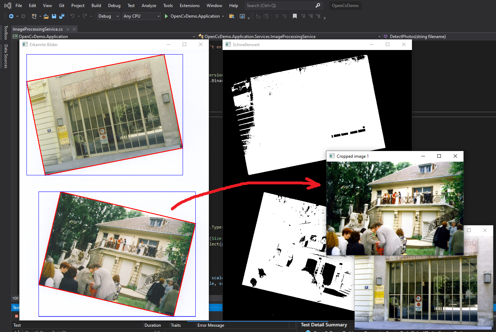
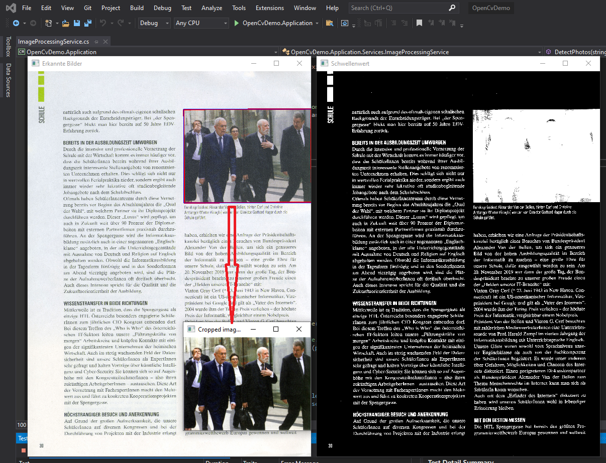

# Open CV Demo

Lade die Solution in der Datei *OpenCvDemo.sln* und öffne die sln Datei
in Visual Studio 2022. Die C# Projekte benötigen .NET 6.

Führe danach die Unittests aus:

- **DetectPhotosSuccessTest** erkennt einzelne Bilder, die gemeinsam eingestannt wurden. Die
  Bilder werden in die Dateien *extract_(date)_(nr).jpg* im Ausgabeordner 
  (*OpenCvDemo.Test/bin/Debug/net6.0*) geschrieben. Schließe alle OpenCV Fenster, damit der
  Test beendet wird.
- **DetectPhotosInTextSuccessTest** erkennt Bilder im Text. Die
  Bilder werden in die Dateien *extract_(date)_(nr).jpg* im Ausgabeordner 
  (*OpenCvDemo.Test/bin/Debug/net6.0*) geschrieben. Schließe alle OpenCV Fenster, damit der
  Test beendet wird.
- **GetTextSuccessTest** erkennt Text auf einer Seite und liefert ihn zurück. Der Text
  ist in der Datei *content.txt* im Ausgabeverzeichnis.

## Weitere Infos

- NuGet Paket OpenVcSharp 4: [https://www.nuget.org/packages/OpenCvSharp4/](https://www.nuget.org/packages/OpenCvSharp4/)
- Projektseite: [https://github.com/shimat/opencvsharp](https://github.com/shimat/opencvsharp)
- Samples auf [https://github.com/shimat/opencvsharp_samples/](https://github.com/shimat/opencvsharp_samples/) und
  [https://github.com/shimat/opencvsharp/wiki](https://github.com/shimat/opencvsharp/wiki)
