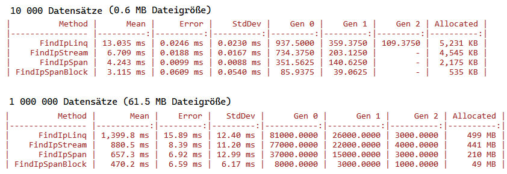
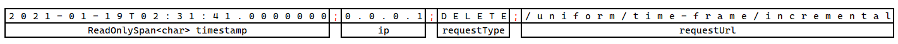

# Benchmarking am Beispiel von Spans

## Problemstellung

Es soll eine Logdatei, wie sie z. B. von einem Webserver kommen kann, ausgewertet werden. Diese
Logdateien sind für gewöhnlich sehr groß (mehrere GB). Unsere Datei hat folgenden Aufbau:

```text
2021-05-06T16:31:01.0000000;0.0.0.2;PUT;/computers-games--grocery/pink/metal
2021-01-03T06:08:23.0000000;0.0.0.4;POST;/deposit
2021-09-11T21:25:11.0000000;0.0.0.3;PUT;/analyzing/somali-shilling
2021-09-19T22:11:33.0000000;0.0.0.3;PUT;/arizona/models
2021-07-11T01:58:36.0000000;0.0.0.4;POST;/cfp-franc/gardens/shoes--garden
2021-04-03T10:55:17.0000000;0.0.0.1;GET;/hard-drive
2021-01-19T02:31:41.0000000;0.0.0.1;DELETE;/uniform/time-frame/incremental
...
```

Sie beinhaltet einen Zeitstempel, die IP Adresse des Clients, die HTTP Methode und die URL. Als
IP Adressen werden nur 0.0.0.1, 0.0.0.2, 0.0.0.3, 0.0.0.4 verwendet, um bei einer Suche die
Anzahl der Ergebnisse abschätzen zu können.

Es soll nun eine Methode geschrieben werden, die eine bestimmte IP aus der Datei sucht die gefundenen
Daten als Liste von LogEntries zurückgibt.

*LogEntry* ist eine normale POCO Klasse, die die einzelnen Datenfelder beinhaltet:

```c#
public record LogEntry(
    DateTime Timestamp,
    string Ip,
    string RequestType,
    string RequestUrl)
{
    public override string ToString() => $"{Timestamp.ToString("O")};{Ip};{RequestType};{RequestUrl}";
}   
```

## Ausführen des Programmes

Das Programm benötigt .NET 6.

```text
cd LogAnalyzer.Benchmark
dotnet run -c Release
```

Die Anzahl der Datensätze kann in der Datei [AnalyzerBenchmarks.cs](LogAnalyzer.Benchmark/AnalyzerBenchmarks.cs)
über die Klassenvariable *_lines* gesteuert werden.

Das Projekt hat folgenden Aufbau:

```text
LogAnalyzer.sln
     |
     +------- LogAnalyzer.Application
     |                  |
     |                  +---------- LogEntry.cs
     |                  |
     |                  +---------- Analyzer.cs              Applikationslogik
     +------- LogAnalyzer.Benchmark
                        |
                        +---------- AnalyzerBenchmark.cs     Aufruf der Methoden aus Analyzer.cs
                        |
                        +---------- Program.cs
```

## Diskussion der Ergebnisse

Die Implementierungen liefern natürlich immer die gleiche Ergebnisliste. Allerdings ist der
Speicherbedarf sehr unterschiedlich:



Zur Erklärung von Gen 0, Gen 1 und Gen 2: Füllt sich der Speicher am Heap, prüft der Garbage Collector
die Objekte dahingehend, ob darauf referenziert wird. Wenn nein, wird das Objekt gelöscht. Dies
ist allerdings ein zeitaufwändiger Vorgang. Deswegen gibt es ein dreistufiges Konzept:
- Die Objekte werden geprüft. Verwendete Objekte werden in Gen 1 verschoben.
- Füllt sich der Speicher wiederum, werden nur die neuen (Gen 0) Objekte geprüft. Wird durch das
  Entfernen schon genug Speicher freigemacht, wird Gen 1 und Gen 2 nicht geprüft.
- Reicht das Entfernen der unbenutzten Objekte nicht, wird Gen 1 geprüft. Benutzte Objekte werden
  von Gen 1 nach Gen 2 verschoben.

Über Gen 0, Gen 1 und Gen 2 kann also abgelesen werden, wie viele kurzlebige Objekte (Gen 0) und wie viele
langlebige Objekte (Gen 2) am Heap existieren. Dieses Konzept macht Sinn, denn oft wird innerhalb von
Schleifen eine Variable deklariert. Diese Objekte sind sehr kurzlebig und können eher entfernt
werden als Objekte außerhalb der Schleife.

Wenn wir weniger Objekte am Heap anlegen, muss der Garbare Collector weniger oft aktiv werden. Dies
verbessert dann auch die Performance, was die Laufzeit betrifft. Speicherbedarf und Laufzeit hängen
also zusammen!

## Implementierte Varianten

Zum Einlesen von CSV Dateien gibt es mit [CsvHelper](https://www.nuget.org/packages/CsvHelper/) ein
bekanntes und flexibles Paket. Wir implementieren die Methoden aber direkt, um den Code besser
analysieren zu können.

### Variante 1: Mit LINQ + String.Split()

Gerade Anfänger würden diese Problemstellung so implementieren:
- Den Inhalt in den Speicher lesen
- Aus jeder Zeile ein *LogEntry* Objekt mit *Split()* erstellen
- Danach werden die passenden Daten zurückgegeben.

```c#
public List<LogEntry> FindIpLinq(string ip)
{
    var content = File.ReadAllLines(_filename, new UTF8Encoding(encoderShouldEmitUTF8Identifier: false));
    return content
        .Select(line =>
        {
            var cells = line.Split(";");
            return new LogEntry(DateTime.Parse(cells[0]), cells[1], cells[2], cells[3]);
        })
        .Where(entry => entry.Ip == ip)
        .ToList();
}
```

Hier wird allerdings sehr viel Speicher am Heap allokiert:
- Die gesamte Datei wird direkt in den Speicher gelesen. Dieses Stringarray muss angelegt werden.
- Jede Zeile wird mit *Split()* in Strings aufgeteilt. Diese einzelnen Strings werden ebenfalls
  angelegt.
- Die Instanz von LogEntry muss in *Select()* ebenfalls angelegt werden, obwohl sie vielleicht
  gar nicht gebraucht wird.

Bei 1&puncsp;000&puncsp;000 Datensätzen entsprechen ca. 250&puncsp;000 dem Suchfilter. Notwendig
sind also 250&puncsp;000 Instanzen von *LogEntry* in einer Liste, die zurückgegeben werden soll.
Das Array mit dem gesamten Dateiinhalt und die Teilstrings für nicht benutzte Zeilen aus *Split()*
können vom Garbage Collector direkt nach Beendigung der Methode wieder entfernt werden. Wir haben
den Heap also "zugemüllt".

### Variante 2: Zeilenweise vom Stream lesen + String.Split()

Fortschrittliche Entwickler haben keine Berührungsängste mit Streams. Dadurch kann Zeile für Zeile
gelesen werden. Wir brauchen zwar weiterhin *Split()* und erzeugen mit *ReadLine()* für jede
Zeile in der Datei einen String, der Unterschied zur vorigen Implementierung ist jedoch das *if*.
Es wird nur ein LogEntry erstellt, wenn die IP Adresse auch passt.

Die Differenz im Speicherbedarf (441 MB vs. 499 MB) ist aber nicht sehr groß, da wie gesagt zwar
zeilenweise gelesen wird, im Endeffekt trotzdem jede Zeile als String auf den Heap kommt und *Split()*
auch für jede Zeile durchgeführt wird. Der Speicher muss allerdings nicht auf einmal vorhanden sein,
deswegen können auch große Dateien mit z. B. 100 GB gelesen werden.

```c#
public List<LogEntry> FindIpStream(string ip)
{
    var results = new List<LogEntry>();

    using var streamReader = new StreamReader(_filename, encoding: new UTF8Encoding(encoderShouldEmitUTF8Identifier: false));
    while (true)
    {
        var line = streamReader.ReadLine();
        if (line is null) { break; }
        var cells = line.Split(";");
        if (cells[1] == ip)
        {
            results.Add(new LogEntry(DateTime.Parse(cells[0]), cells[1], cells[2], cells[3]));
        }
    }
    return results;
}
```

### Variante 3: Zeilenweise vom Stream lesen und Parsen als Span

Nun wollen wir das Anlegen von Teilstrings mit *Split()* am Heap vermeiden. Wenn eine Zeile
gelesen wird, hat sie folgenden Inhalt:

```text
2021-01-19T02:31:41.0000000;0.0.0.1;DELETE;/uniform/time-frame/incremental
```

Unsere Idee ist folgende: Anstatt separate Teilstrings anzulegen, speichern wir die Teile als
*Span\<char\>*. Ein *Span* ist eine Sicht auf einen Speicherbereich (hier ein char Array). Er
hat nur eine Startadresse und eine Länge. Es wird auf den Originalinhalt verwiesen, deswegen
wird keine Kopie angelegt.



Die Logik des Parsers wird natürlich länger und spezifischer:

```c#
public List<LogEntry> FindIpSpan(string searchIp)
{
    var results = new List<LogEntry>();
    var searchIpSpan = searchIp.AsSpan();
    using var streamReader = new StreamReader(_filename, encoding: new UTF8Encoding(encoderShouldEmitUTF8Identifier: false));
    while (true)
    {
        var line = streamReader.ReadLine();
        if (line is null) { break; }
        var lineSpan = line.AsSpan();

        // Bis zum ersten ; lesen und den Zeitstempel als Span speichern.
        int found = lineSpan.IndexOf(';');
        var timestamp = lineSpan.Slice(0, found);
        lineSpan = lineSpan.Slice(found + 1);

        // Bis zum zweiten ; lesen und die IP als Span speichern.
        found = lineSpan.IndexOf(';');
        var ip = lineSpan.Slice(0, found);
        if (!ip.Equals(searchIpSpan, StringComparison.Ordinal)) { continue; }
        lineSpan = lineSpan.Slice(found + 1);

        // Bis zum dritten ; lesen und den Request Type als Span speichern.
        found = lineSpan.IndexOf(';');
        var requestType = lineSpan.Slice(0, found);
        lineSpan = lineSpan.Slice(found + 1);
        
        // Der Rest der Zeile ist die URL
        var requestUrl = lineSpan;

        // Das neue LogEntry erstellen. Hier muss in einen String umgewandelt werden.
        results.Add(new LogEntry(DateTime.Parse(timestamp), ip.ToString(), requestType.ToString(), requestUrl.ToString()));
    }
    return results;
}
```

Der Vorteil ist allerdings deutlich messbar: Statt 499 MB benötigen wir nur mehr *210 MB*.

### Variante 4: Blockweise vom Stream lesen und Parsen als Span

Nun wollen wir die letzten Strings, die beim Lesen der Datei am Heap angelegt werden, auch noch
entfernen. Zuvor haben wir mit *ReadLine()* bequem eine einzelne Zeile abrufen können. Dadurch
musste allerdings ein String angelegt werden. Wir können auch direkt einen Span über den Stream
befüllen. Allerdings geht dadurch Komfort verloren: Wir bekommen einen Block von n Zeichen (n ist
die Länge des Puffers). Das Trennen an den Zeilenumbrüchen ist jetzt uns überlassen.

```c#
public List<LogEntry> FindIpSpanBlock(string searchIp)
{
    var results = new List<LogEntry>();
    var searchIpSpan = searchIp.AsSpan();
    var buffer = new char[1024].AsSpan();
    using var streamReader = new StreamReader(_filename, encoding: new UTF8Encoding(encoderShouldEmitUTF8Identifier: false));
    int remaining = 0;
    while (true)
    {
        int count = streamReader.Read(buffer.Slice(remaining));
        if (count == 0) { break; }
        //buffer = buffer.Slice(0, count + remaining);
        ReadOnlySpan<char> lineBuffer = buffer.Slice(0, count + remaining);
        while (true)
        {
            int lineEnd = lineBuffer.IndexOf('\n');
            if (lineEnd == -1) { break; }
            var line = lineBuffer.Slice(0, lineEnd - 1);    // Windows CR+LF: CR nicht zur Zeile geben.
            lineBuffer = lineBuffer.Slice(lineEnd + 1);

            int found = line.IndexOf(';');
            var timestamp = line.Slice(0, found);
            line = line.Slice(found + 1);

            found = line.IndexOf(';');
            var ip = line.Slice(0, found);
            if (!ip.Equals(searchIpSpan, StringComparison.Ordinal)) { continue; }
            line = line.Slice(found + 1);

            found = line.IndexOf(';');
            var requestType = line.Slice(0, found);
            line = line.Slice(found + 1);

            var requestUrl = line;
            results.Add(new LogEntry(DateTime.Parse(timestamp), ip.ToString(), requestType.ToString(), requestUrl.ToString()));
        }
        remaining = lineBuffer.Length;
        lineBuffer.CopyTo(buffer);                         // Restliche Daten an den Anfang des Buffers geben.

    }
    return results;
}
```

Diese Lösung belegt nur mehr 1/10 der ursprünglichen Variante 1 (49 MB statt 499 MB) am Heap. Diese
Daten sind die Nutzdaten, die wir als Liste zurückgeben. Der einzige Overhead entsteht durch die
Liste selbst. Sie verwendet ein Array zur Speicherung der Elemente. Ist es zu klein, definiert
die List Klasse ein neues und doppelt so großes Array. Danach wird kopiert und das alte Array bleibt
am Heap zurück.

## Kritische Diskussion

Betrachte die Implementierung der 4. (und performantesten) Variante. Ist das "schöner Code" im Sinne
von Erweiterbarkeit und gängigen Programmierparadigmen? Würdest du auch eine 30 MB große Datei damit
bearbeiten?

Was ist für ein Unternehmen billiger? Das Implementieren eines performanteren Algorithmus oder das
Hochskalieren der Instanz in der Cloud?
