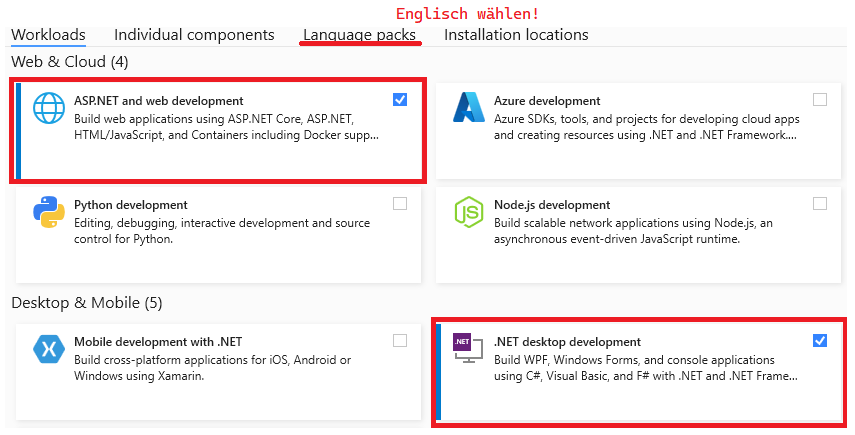
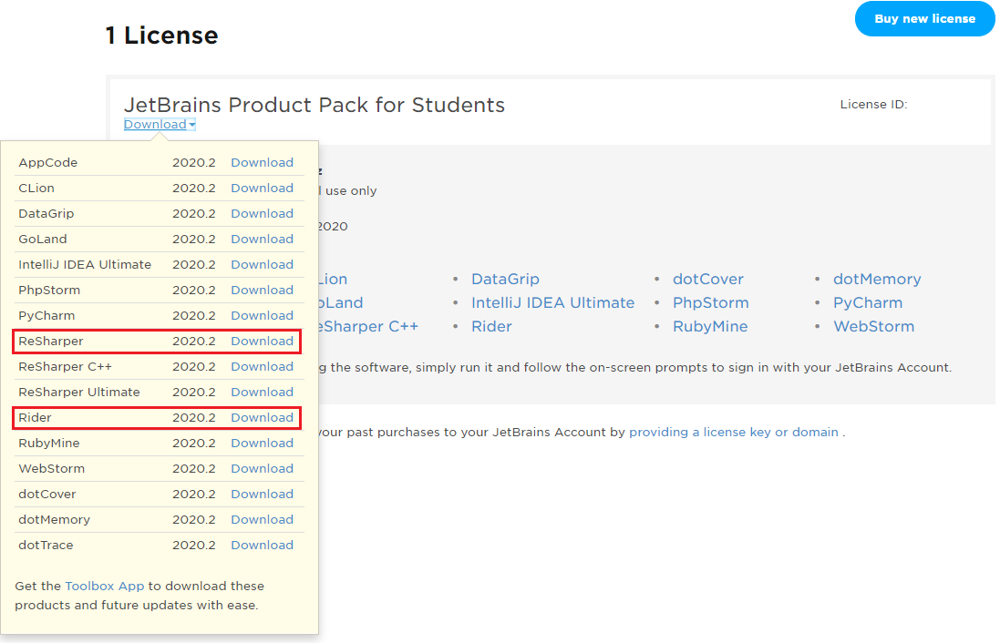
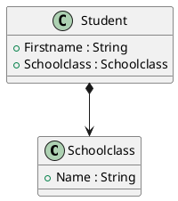

# POS im III. Jahrgang / 5. Semester Kolleg der HTL Spengergasse

## Wichtiges zum Start

### Installation der IDE Visual Studio 2022

Die verbreitetste IDE zur Entwicklung im .NET Bereich ist Visual Studio. Microsoft stellt unserer
Schule eine Lizenz von Visual Studio Enterprise zur Verfügung.

- Lade die Testversion von Visual Studio **Enterprise** von https://visualstudio.microsoft.com/de/downloads/
  herunter.
- Installiere die nachfolgenden Workloads und achte bei den Sprachpaketen darauf, nur *Englisch* auszuwählen.
- Der Key wird im Unterricht ausgegeben.



### Alternativ: Verwenden von JetBrains Rider

Eine andere weit verbreitete Entwicklungsumgebung - gerade unter macOS - ist Rider von JetBrains.
Wer mit IntelliJ gut arbeiten konnte, kann auch mit der Schullizenz Rider beziehen. Logge dich dafür
auf https://account.jetbrains.com/login ein. Wer noch keinen Zugang hat, kann mit der Schul Mailadresse
eine Lizenz gratis beziehen. Nach dem Login steht Rider als Download zur Verfügung




### PlantUML und VS Code als Modellierungswerkzeug

In der Konzeptionierungsphase ist ein grafisches Tool zum Erzeugen von Klassenmodellen sehr wichtig.
In diesen Kurs werden immer wieder UML Klassendiagramme hergezeigt. Sie können mit VS Code und
PlantUML erzeugt werden:

1. Prüfe, ob Java installiert und im PATH eingetragen ist. Der Befehl *java -version* muss erkannt werden.
1. Installiere [Visual Studio Code](https://code.visualstudio.com). Achtung: Aktiviere beim Setup
   die Option "In den Explorer integrieren", damit Sie im Kontextmenü VS Code starten können.
1. Installiere die folgenden Extensions:
   - Markdown PDF
   - Markdown Preview Enhanced
   - PlantUML
1. Öffne die VS Code Konfiguration (*F1* - "*settings*" eingeben - "*Preferences: Open Settings (JSON)*" wählen)
   und füge folgende Zeilen hinzu:

```javascript
    "markdown-pdf.plantumlOpenMarker": "```plantuml\n",
    "markdown-pdf.plantumlCloseMarker": "```"   
```

Nun steht durch die Extension *Markdown Preview Enhanced* ein Icon bereit, welches eine Vorschau mit dem gerenderten Diagramm bietet. Beachte: Dies ist nur bei Dokumenten mit der 
Endung *.md* Verfügbar.


Zum Testen kann nun eine neue Datei *Modell.md* mit folgendem Inhalt erstellt werden:

````
# Ein Klassenmodell

Das ist die Beschreibung.

````
## Weiterführende Unterlagen:

- YouTube Channels: [dotNET](https://www.youtube.com/channel/UCvtT19MZW8dq5Wwfu6B0oxw),
  [Nick Chapsas](https://www.youtube.com/channel/UCrkPsvLGln62OMZRO6K-llg),
  [NDC Conferences](https://www.youtube.com/channel/UCTdw38Cw6jcm0atBPA39a0Q)
- [C# 8.0 in a Nutshell: The Definitive Reference](https://www.amazon.de/C-8-0-Nutshell-Definitive-Reference-dp-1492051136/dp/1492051136/ref=dp_ob_title_bk)
- [Functional Programming in C#: How to write better C# code](https://www.amazon.de/Functional-Programming-C-Enrico-Buonanno/dp/1617293954/ref=sr_1_1?__mk_de_DE=%C3%85M%C3%85%C5%BD%C3%95%C3%91&crid=18ZFWZ2G0KO0J&dchild=1&keywords=functional+programming+c%23&qid=1600494628&sprefix=Functional+programmin%2Caps%2C174&sr=8-1)

## Synchronisieren des Repositories in einen Ordner

Installiere die neueste Version von [git](https://git-scm.com/downloads) mit den Standardeinstellungen.
Gehe danach in die Windows Eingabeaufforderung (cmd) und führe in einem geeigneten Ordner
(z. B. *C:\POS*) den Befehl
```
git clone https://github.com/schletz/Pos3xhif.git
```

Soll der neueste Stand vom Server geladen werden, führe die Datei *resetGit.cmd* aus. Achtung:
alle lokalen Änderungen werden dabei zurückgesetzt.

