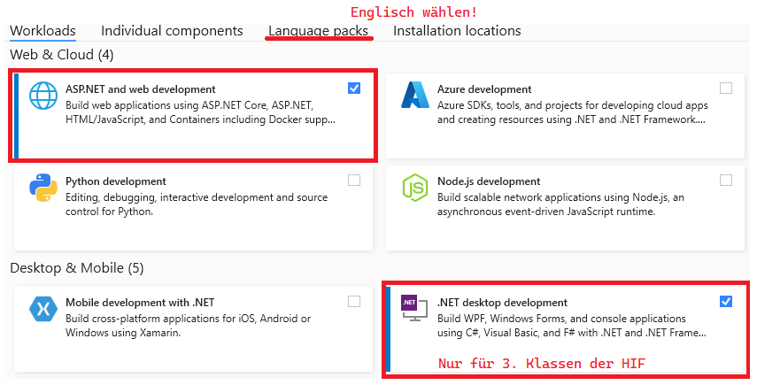
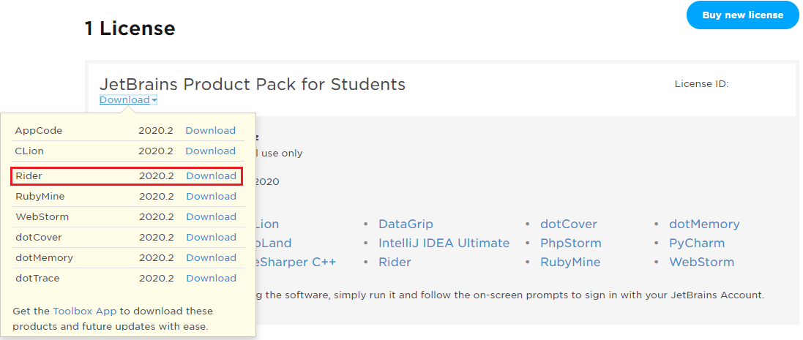

# POS im III. Jahrgang / 5. Semester Kolleg der HTL Spengergasse

## Lehrinhalte

- **Types in C#**
  - [Value Types](01%20Types/01_ValueTypes.md)
  - [Reference Types](01%20Types/02_ReferenceTypes.md)
  - [Properties](01%20Types/03_Properties.md)
  - [Collections](01%20Types/04_Collections.md)
  - [Vererbung](01%20Types/05_Vererbung.md)
  - [Interfaces](01%20Types/06_Interfaces.md)
  - [Equality](01%20Types/07_Equality.md)
  - [Dependency Injection](01%20Types/08_DependencyInjection.md)
  - *[Übungsaufgaben](01%20Types/Uebungen)*
- **LINQ - Language Integrated Query**
  - [Lambda Expressions](02%20Linq/01_Lambdas/README.md)
  - [Filterausdrücke](02%20Linq/../02%20Linq/02_Filterung/README.md)
  - [Projektionen](02%20Linq/03_Projection/README.md)
  - [Gruppierung](02%20Linq/04_GroupBy/README.md)
  - [Query Syntax](02%20Linq/05_QuerySyntax/README.md)
  - [Joins](02%20Linq/06_Join_Grouping/README.md)
- **Der OR Mapper EF Core**
  - [Warum OR Mapping?](03%20EF%20Core/01_WhyORMapping/README.md)
  - [Code first](03%20EF%20Core/02_CodeFirstEfCore5/README.md)
  - [Enhanced code first](03%20EF%20Core/03_EnhancedCodeFirst/README.md)
  - [Rich domain models](03%20EF%20Core/04_RichDomainModels/README.md)
  - [Queries](03%20EF%20Core/05_Queries/README.md)
  - [CRUD Operationen](03%20EF%20Core/06_Crud/README.md)
  - [Database first](03%20EF%20Core/07_DatabaseFirst/README.md)
  - [Migrations](03%20EF%20Core/08_Migrations/README.md)
- **WPF - Windows Presentation Foundation (nur HIF)**
  -  [Intro - Catch the ball](04%20WPF/01_CatchTheBall/Readme.md)
  -  [ViewModels](04%20WPF/02_ViewModelDemoApp/Readme.md)
  -  [Relay Command](04%20WPF/03_RelayCommand/Readme.md)
  -  [Lists](04%20WPF/04_Lists/Readme.md)
  -  [EF Core und WPF](04%20WPF/05_EF_Core/README.md)
  -  [Validations](04%20WPF/06_Validation/Readme.md)
- **TPL - Task Parallel Library**
  -  [CPU bound work](05%20TPL/01%20CpuBoundWork/README.md)
  -  [Await und async](05%20TPL/02%20AwaitAsyncDemo/Readme.md)
  -  [IO und TPL: der file writer](05%20TPL/03%20FileWriterApp)
- **Erweiterungskapitel: Professional C#**
  - [Extension methods](Professional%20C%23/10_ExtensionMethods/README.md)
  - [Generics](Professional%20C%23/20_Generics/README.md)
  - [Fluent APIs](Professional%20C%23/30_FluentApi/README.md)
  - [ML.NET Demo](Professional%20C%23/40_LocationDemo/README.md)
  - [Bildverarbeitung mit OpenCV](Professional%20C%23/50_OpenCv/README.md)
  - [Performanceoptimierung und Speichermanagement](Professional%20C%23/60_LogAnalyzer/README.md)
  - [Benchmarking](Professional%20C%23/70_Benchmark/README.md)

## Wichtiges zum Start

### Installation der IDE Visual Studio 2022

Die verbreitetste IDE zur Entwicklung im .NET Bereich ist Visual Studio. Microsoft stellt unserer
Schule eine Lizenz von Visual Studio Enterprise zur Verfügung.

- Lade die Testversion von Visual Studio **Enterprise** von https://visualstudio.microsoft.com/de/downloads/
  herunter.
- Installiere die nachfolgenden Workloads und achte bei den Sprachpaketen darauf, nur *Englisch* auszuwählen.
- Der Key wird im Unterricht ausgegeben.

> **Hinweis:** Der Workload *.NET desktop development* wird nur für den 3. Jahrgang der HIF benötigt.
> Für Kollegs und Aufbaulehrgänge ist nur *ASP.NET and web development* erforderlich.



### Alternativ: Verwenden von JetBrains Rider

Eine andere weit verbreitete Entwicklungsumgebung - gerade unter macOS - ist Rider von JetBrains.
Ab der Version 2021.3 unterstützt Rider auch .NET 6.
Wer mit IntelliJ gut arbeiten konnte, kann auch mit der Schullizenz Rider beziehen. Logge dich dafür
auf https://account.jetbrains.com/login ein. Wer noch keinen Zugang hat, kann mit der Schul Mailadresse
eine Lizenz gratis beziehen. Nach dem Login steht Rider als Download zur Verfügung.



## PlantUML und Markdown

Siehe Dokument [plantuml.md](plantuml.md)

## Weiterführende Unterlagen:

- YouTube Channels: [dotNET](https://www.youtube.com/channel/UCvtT19MZW8dq5Wwfu6B0oxw),
  [Nick Chapsas](https://www.youtube.com/channel/UCrkPsvLGln62OMZRO6K-llg),
  [NDC Conferences](https://www.youtube.com/channel/UCTdw38Cw6jcm0atBPA39a0Q)
- [C# 8.0 in a Nutshell: The Definitive Reference](https://www.amazon.de/C-8-0-Nutshell-Definitive-Reference-dp-1492051136/dp/1492051136/ref=dp_ob_title_bk)
- [Functional Programming in C#: How to write better C# code](https://www.amazon.de/Functional-Programming-C-Enrico-Buonanno/dp/1617293954/ref=sr_1_1?__mk_de_DE=%C3%85M%C3%85%C5%BD%C3%95%C3%91&crid=18ZFWZ2G0KO0J&dchild=1&keywords=functional+programming+c%23&qid=1600494628&sprefix=Functional+programmin%2Caps%2C174&sr=8-1)

## Synchronisieren des Repositories in einen Ordner

Installiere die neueste Version von [git](https://git-scm.com/downloads) mit den Standardeinstellungen.
Gehe danach in die Windows Eingabeaufforderung (cmd) und führe in einem geeigneten Ordner
(z. B. *C:\POS*) den Befehl
```
git clone https://github.com/schletz/Pos3xhif.git
```

Soll der neueste Stand vom Server geladen werden, führe die Datei *resetGit.cmd* aus. Achtung:
alle lokalen Änderungen werden dabei zurückgesetzt.

