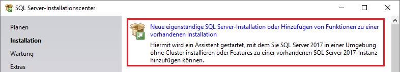
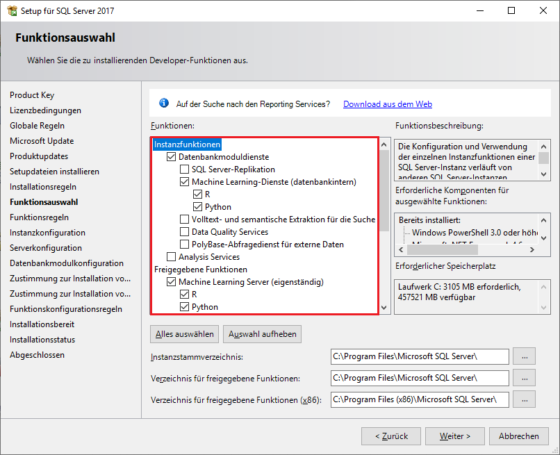

# Installation von SQL Server 2017

## Installation der Datenbank
Lade von der [SQL Server Downloadseite](https://www.microsoft.com/de-de/sql-server/sql-server-downloads)
den Installer für die Developer Edition herunter. Sie ist ident mit der Enterprise Edition, nur kann sie
auch auf einem nicht Server Betriebssystem installiert werden. Für den kommerziellen Einsatz ist allerdings
die kostenpflichtige Enterprise Version nötig.

Nach dem Starten des Installers wählt man unter *Installation* den Punkt *Neue eigenständige SQL Server
Installation*.



Die anderen Einstellungen können so belassen werden. Bei der Frage nach den Updates kann die Option, dass
SQL Server Updates über die Windows Update Funktion geladen werden, aktiviert werden. Bei der *Funktionsauswahl*
kann bei Interesse noch die Machine Learning Dienste (datenbankintern und eigenständig ausgewählt werden.



Der wichtigste Punkt ist das Einrichten des Administrationsusers. Hierfür wähle den Punkt *Gemischter Modus*
und weise ein Kennwort für den Benutzer sa zu. Außerdem musst du noch den aktuellen Windows Benutzer mit
dem Button *Aktuellen Benutzer hinzufügen* in die Gruppe der Datenbankadministratoren aufnehmen.


## Installation des SQL Server Management Studios

Das SQL Server Management Studio (SSMS) kann über [die Downloadseite](https://docs.microsoft.com/en-us/sql/ssms/download-sql-server-management-studio-ssms?view=sql-server-2017)
kostenlos bezogen werden. Es stellt einen SQL Editor und die Verwaltungsfunktionen des Servers bereit.

## Aktivieren von TCP/IP (nur wenn erforderlich)

Nach der Installation ist nur der Shared Memory Zugriff auf den SQL Server aktiviert. Soll auch über
TCP/IP (127.0.0.1, Port 1433) zugegriffen werden, muss dies im *SQL Server Configuration Manager* aktiviert
werden. Dafür gehe auf *Ausführen* und gib folgenden Befehl ein: *C:\Windows\SysWOW64\SQLServerManager14.msc*.
Nun kann TCP/IP wie auf folgender Abbildung aktiviert werden:


Nach der Aktivierung muss der Server Dienst *SQL Server (MSSQLSERVER)* über den Punkt *SQL Server Dienste* 
im Configuration Manager neu gestartet werden. Damit der Server von außen auch erreichbar ist, müssen
eingehende Verbindungen in der Firewall auf Port 1433 erlaubt werden. Natürlich muss dann der SQL Server
entsprechend abgesichert sein!

## Prüfen, ob der Server läuft

Unter *Dienste* im Startmenü kann nachgesehen werden, ob der Dienst *SQL Server (MSSQLSERVER)* läuft.
In der Konsole kann geprüft werden, ob nach Eingabe des Befehles *netstat -a -n* der Port 1433 abgehört 
wird:

```
 Proto  Lokale Adresse         Remoteadresse          Status
  TCP    0.0.0.0:1433           0.0.0.0:0              ABHÖREN
```
