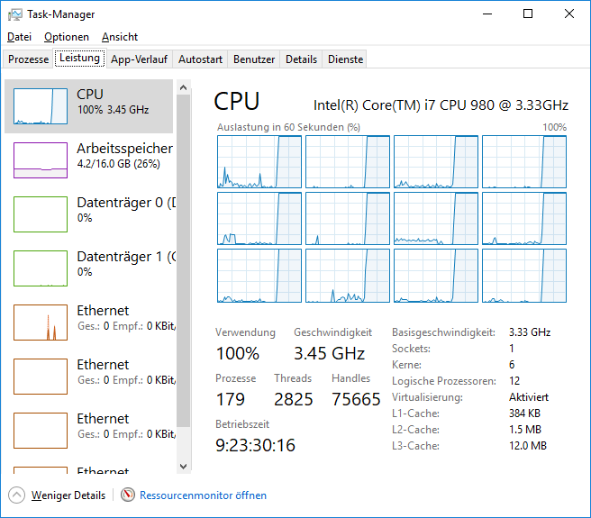

# Parallelisierung von CPU intensiven Aufgaben
In diesem Beispiel wird eine sehr alte mathematische Frage, nämlich die Bestimmung der Primzahlen in
einem bestimmten Zahlenbereich, gelöst.

Die Methode, die prüft ob eine übergebene Zahl eine Primzahl ist, wurde - um CPU Arbeit zu generieren -
nicht optimiert:
```c#
static bool IsPrime(int number)
{
    for (int i = 2; i < number; i++)
    {
        if (number % i == 0) return false;
    }
    return true;
}
```

Nach dem bisherigen Wissenstand in Programmieren würde das Programm so gelöst werden:
```c#
const int START_NUMBER = 500000000;
const int NUMBER_COUNT = 100;
for (int number = START_NUMBER; number < START_NUMBER + NUMBER_COUNT; number++)
{
    if (IsPrime(number))
        primes.Add(number);
}
```

In Zeiten von mehreren CPU Kernen ist dieser Ansatz allerdings nicht mehr zeitgemäß. Sehen wir uns die
CPU Auslasung an:


Nur der rot eingerahmte Kern ist ausgelastet. Die anderen Kerne zeigen keine Auslastung. Um das zu ändern,
gibt es verschiedene Ansätze in der TPL. Hier haben wir folgende Situation: Eingabedaten werden unabhängig
voneinander verarbeitet. In dieser Situation gibt es die statische Klasse *Parallel*, die eine *For* 
Methode bereitstellt:
```c#
Parallel.For(START_NUMBER, START_NUMBER + NUMBER_COUNT, (number) =>
{
    Interlocked.Add(ref runningTasks, 1);
    Console.Write($" {runningTasks}");
    if (IsPrime(number))
        lock (primes) { primes.Add(number); }
    Interlocked.Add(ref runningTasks, -1);

});
```

Der Code zeigt schon die einfache Anwendung: die ersten beiden Parameter sind die Zählerwerte (Start und
exklusives Ende), das 3. Argument ist vom Typ *Action<int>*, wobei der Parameter der aktuelle Zählerstand
ist. Da dieser Block parallel ausgeführt wird, müssen wir aber beim Zugriff auf eine gemeinsame Variable
(in diesem Fall die Liste *primes*) darauf achten, dass nicht gleichzeitig in diese Liste geschrieben wird.
Durch *lock(referenceVariable)* wird dieser Block nur einmal ausgeführt. Die anderen Threads müssen warten,
bis diese Anweisung verlassen wurde. **Wird das nicht gemacht, wird vermutlich das Programm auch ohne
Fehler funktionieren. Bei speziellen Eingabewerten kommt es aber zu Fehlern. Diese sind nicht vorhersagbar
und daher besonders schwer zu identifizieren!**

Die Anweisung *Interlocked.Add(ref runningTasks, 1);* ist für die Bestimmung der Anzahl der gleichzeitig
laufenden Tasks. Wir können auch *lock(){}* verwenden, da das threadsichere Inkrementieren von Variablen
aber häufig vorkommt, gibt es mit der statischen Klasse *Interlocked* die Möglichkeit, dies als atomare
Operation (kann nicht unterbrochen werden) auszuführen.

Der Taskmanager zeigt bei der Ausführung nun eine wesentlich bessere Auslastung (100%):


Dementsprechend ist die Laufzeit des Programmes auch viel besser, in unserem Fall ca. 5x schneller:
```
SUCHE DIE PRIMZAHLEN ZWISCHEN 500000000 und 500000500...
SYNCHRONES ERMITTELN DER PRIMZAHLEN
35 Zahlen gefunden: 500000003,500000009,500000041,500000057,500000069,500000071,500000077,500000089,500000093,500000099,500000101,500000117,500000183,500000201,500000227,500000231,500000233,500000261,500000273,500000299,500000317,500000321,500000323,500000353,500000359,500000377,500000387,500000393,500000437,500000443,500000461,500000467,500000483,500000489,500000491
PARALLELES ERMITTELN DER PRIMZAHLEN
12 Prozessoren
Laufende Tasks: 1 1 1 1 2 3 3 3 3 3 3 3 3 4 4 4 4 4 4 4 4 4 4 4 4 4 4 4 4 4 4 4 4 5 5 5 5 5 5 5 5 5 5 5 5 5 5 5 5 6 6 7 7 8 8 8 9 9 9 9 9 9 9 9 9 9 9 9 9 9 9 9 9 9 6 10 10 10 10 10 11 11 10 11 11 11 11 11 11 11 11 11 11 11 9 11 11 11 11 11 11 11 11 11 11 11 11 11 11 11 11 12 12 12 12 12 12 12 12 12 12 12 12 12 12 12 12 12 12 12 12 11 11 12 12 12 12 12 12 9 12 13 13 12 7 13 13 13 13 13 5 13 13 13 13 13 13 13 13 13 13 13 13 12 13 13 13 13 12 13 13 13 13 13 13 13 13 13 13 13 13 13 13 13 13 13 13 13 13 13 13 13 13 13 13 13 13 11 13 13 13 13 13 13 13 13 13 13 13 13 13 13 13 13 13 13 13 13 13 13 13 13 13 13 13 13 13 13 13 13 13 13 13 13 13 13 13 13 13 13 13 13 13 13 13 13 12 12 13 13 13 13 13 13 13 13 13 13 12 13 13 13 13 13 13 13 13 13 13 13 13 13 13 13 13 13 13 13 13 13 13 13 13 13 13 13 13 13 13 13 13 13 13 13 13 13 13 13 13 13 13 13 13 13 13 13 13 13 13 13 13 13 13 13 13 13 13 13 13 13 13 13 13 13 13 13 13 13 13 13 13 13 13 13 13 13 13 13 13 13 13 13 13 13 13 13 13 13 13 13 13 13 13 13 13 13 13 13 13 13 13 13 13 13 13 13 13 13 13 13 13 13 13 13 13 13 13 13 13 13 13 13 13 13 13 13 13 13 13 13 13 13 13 13 13 13 13 13 13 13 13 13 13 13 13 13 13 13 13 13 13 13 13 13 13 13 13 13 13 13 13 13 13 13 13 13 13 13 12 12 12 11 11 11 11 11 11 11 11 11 11 11 11 11 11 10 10 10 10 10 10 9 9 9 9 9 9 9 8 8 8 8 8 8 8 8 8 8 6 6 6 6 6 5 5 5 5 5 5 4 4 4 4 4 4 3 3 2 2 2 2 2 2 2 2 2 2 2 2 2
35 Zahlen gefunden: 500000227,500000299,500000041,500000089,500000183,500000261,500000353,500000003,500000377,500000461,500000201,500000437,500000009,500000069,500000359,500000273,500000321,500000231,500000057,500000093,500000467,500000387,500000317,500000443,500000483,500000077,500000071,500000117,500000099,500000323,500000393,500000233,500000489,500000101,500000491
Synchron: 70.95s, Parallel: 13.63s (Faktor 0.19)
```

## Was bedeuten die laufenden Tasks in der Ausgabe?
In der Zeile *Laufende Tasks* wird bei jedem Durchlaufen der Funktion ausgegeben, wie viele Tasks gerade
laufen. Am Anfang steigt diese Zahl langsam an, da gerade Zahlen sehr schnell verarbeitet werden. Es bleiben
also die Zahlen mit hohen Teilern oder die Primzahlen lange in der Prüfschleife von *IsPrime()*. Der
Maximalwert ist allerdings 13, denn es gibt nur 12 logische CPU Kerne und der 13. wird sozusagen "nachgeladen".

## Experiment
Setze *const int START_NUMBER* auf 0 statt auf 500000000. Die Berechnung geht dann natürlich bei kleinen
Zahlen viel schneller. Die Statistik wandelt sich auf einmal: 
*Synchron: 0.00s, Parallel: 0.15s (Faktor 146.02)*. Wir sehen, dass das Erstellen von Tasks und der 
darunterliegenden Threads einen overhead darstellt, der sich erst rechnen muss. Dauern die Tasks also nur
sehr kurz, kann die synchrone Lösung schneller sein.
