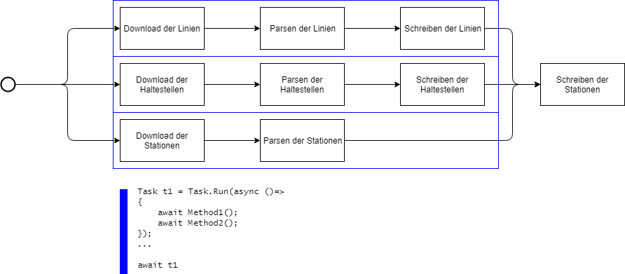

```{r setup, include=FALSE}
if (!require("knitr", quietly = TRUE)) { install.packages("knitr"); library("knitr"); }
knitr::opts_chunk$set(echo = FALSE)
if (!require("tidyverse", quietly = TRUE)) { install.packages("tidyverse"); library("tidyverse"); }
if (!require("gridExtra", quietly = TRUE)) { install.packages("gridExtra"); library("gridExtra"); }
rm(list = ls())
# --------------------------------------------------------------------------------------------------
# LADEN DER EXPORTDATEI AUS DEM ONLINEBANKING
# --------------------------------------------------------------------------------------------------
locale <- locale(date_names = "de", date_format = "%d.%m.%Y", encoding = "UTF-8", decimal_mark=".");
linien <- read_delim("wienerlinien-ogd-linien.csv",";", skip = 0, locale = locale, guess_max = 5000)
steige <- read_delim("wienerlinien-ogd-steige.csv",";", skip = 0, locale = locale, guess_max = 5000)
haltestellen <- read_delim("wienerlinien-ogd-haltestellen.csv",";", skip = 0, locale = locale, guess_max = 5000)

#write_tsv(linien %>% select(LINIEN_ID, BEZEICHNUNG, VERKEHRSMITTEL), "C:/Temp/linien.txt")
#write_tsv(haltestellen %>% select(HALTESTELLEN_ID, NAME), "C:/Temp/haltestellen.txt")
#write_tsv(steige %>% select(STEIG_ID, FK_LINIEN_ID, FK_HALTESTELLEN_ID, STEIG, RICHTUNG, REIHENFOLGE), "C:/Temp/steige.txt")
```

## Intro

Auf [data.gv.at](https://www.data.gv.at/katalog/dataset/stadt-wien_wienerlinienechtzeitdaten) stehen
die Daten der Wiener Linien (Haltestellen, Linien, Steige) als CSV Datei zur Verfügung. Die Dateien sind 
UTF-8 codiert, haben als Trennzeichen ein Semikolon (;) und Strings sind unter Anführungszeichen
gesetzt. Zeilenumbruch ist der Windows Standard CR+LF. Sie können von folgenden Adressen bezogen werden:

- **csv-linien**: *https://data.wien.gv.at/csv/wienerlinien-ogd-linien.csv*
- **csv-haltestellen**: *https://data.wien.gv.at/csv/wienerlinien-ogd-haltestellen.csv*
- **csv-steige**: *https://data.wien.gv.at/csv/wienerlinien-ogd-steige.csv*

Schreibe ein Programm, welches diese Dateien asynchron lädt, parst in in einer Datenbank speichert. Die 
geladenen Linien werden in einer Liste angezeigt. Beim Klick auf eine Linie sollen alle Haltestellen 
dieser Linien in einer weiteren Liste angezeigt werden.

Dafür werden 3 Datensätze benötigt: Die Linien, die Steige und die Haltestellen. Haltestellen und Linien
stellen eine n:m Beziehung dar, da eine Linie mehrere Haltestellen anfährt, und von einer Haltestelle 
mehrere Linien abfahren. Die Auflösungstabelle ist die Datei Steige. Sie gibt an, welche Linien pro
Haltestelle abfahren.

### Die CSV Datei der Linien
Jede Linie hat in der Datei *wienerlinien-ogd-linien.csv* in der Spalte *LINIEN_ID* eine ID, die als 
Fremdschlüssel in der Datei *wienerlinien-ogd-steige.csv* in der Spalte *FK_LINIEN_ID* verwendet wird. 
Daneben gibt es bei den Steigen noch die Spalte *FK_HALTESTELLEN_ID*, die auf die entsprechende Haltestelle 
in der Datei *wienerlinien-ogd-haltestellen.csv* verweist. Anbei die ersten 5 Zeilen der Liniendatei, nicht
benötigte Spalten werden nicht angezeigt:
```{r}
linien %>% select(LINIEN_ID, BEZEICHNUNG, VERKEHRSMITTEL) %>% sample_n(5) %>% kable()
```

### Die CSV Datei der Steige
Wollen wir nun alle Haltestellen der Linie 12A (ID 214433815) wissen, müssen wir die ID in der Datei Steige
suchen und erfahren dort, dass folgende Datensätze zugeordnet sind. Es wird bei der Reihenfolge zwischen 
Hin (Richtung H) und Retour (Reichtung R) unterschieden. Anbei die ersten 5 Steige der Linie 12A, nicht
benötigte Spalten werden nicht angezeigt:
```{r}
steige %>% filter(FK_LINIEN_ID == 214433815, REIHENFOLGE <= 5) %>% select(1:5, STEIG) %>% kable()
```

### Die CSV Datei der Haltestellen
Die Verknüpfung mit der Haltestellendatei gibt uns nun die Namen der Haltestellen zurück. Folgendes Beispiel
liefert die ersten 5 Haltestellen der Linie 12A in der Richtung "H" in der korrekten Reihenfolge:
```{r}
linien %>% 
	left_join(steige, by=c("LINIEN_ID" = "FK_LINIEN_ID")) %>% 
	left_join(haltestellen, by=c("FK_HALTESTELLEN_ID" = "HALTESTELLEN_ID")) %>%
	filter(BEZEICHNUNG == "12A", RICHTUNG == "H", REIHENFOLGE.y <= 5) %>%
	arrange(REIHENFOLGE.y) %>%
	select (HALTESTELLEN_ID = FK_HALTESTELLEN_ID, NAME, REIHENFOLGE = REIHENFOLGE.y, STEIG) %>%
	kable()
```

## 1. Erstellen der Datenbank
Damit die Daten nicht bei jedem Programmstart live aus dem Netz geladen werden müssen, sollen sie in
einer SQL Server Datenbank gespeichert werden. Ein erneutes Laden erfolgt dann nur mehr auf Anforderung des
Users über den Button *Reload*.

Lege mit Hilfe des SQL Server Management Studio (SSMS) eine SQL Server Datenbank mit dem Namen *HaltestellenDb*
an. Danach führe in einem neuen Abfragefenster die folgenden Befehle aus:
```sql
USE HaltestellenDb;
GO

DROP TABLE Steig;
DROP TABLE Haltestelle;
DROP TABLE Linie;

CREATE TABLE Linie (
	L_ID             INTEGER PRIMARY KEY,
	L_Bezeichnung    VARCHAR(200) NOT NULL,
	L_Verkehrsmittel VARCHAR(200) NOT NULL
);

CREATE TABLE Haltestelle (
	H_ID   INTEGER PRIMARY KEY,
	H_Name VARCHAR(200) NOT NULL
);

CREATE TABLE Steig (
	S_ID          INTEGER PRIMARY KEY,
	S_Linie       INTEGER NOT NULL FOREIGN KEY REFERENCES Linie(L_ID),
	S_Haltestelle INTEGER NOT NULL FOREIGN KEY REFERENCES Haltestelle(H_ID),
	S_Steig       VARCHAR(10),
	S_Richtung    CHAR(1) NOT NULL,
	S_Reihenfolge INTEGER NOT NULL
);
```

## 2. Erstellen der WPF Applikation
Die WPF Applikation soll folgende Programmiertechniken umsetzen:

- Im *Initialized* Event von Window soll geprüft werden, ob Linien, Haltestellen und Steige in der Datenbank
  vorhanden sind. Wenn eine Tabelle Leer ist, so sollen die Daten über HTTP nachgeladen werden.
- Es sind die asynchronen Methoden *HttpClient.GetStringAsync()* und *HaltestellenDb.SaveChangesAsync())*  
  in Verbindung mit *await* zu verwenden.
- CPU intensive Vorgänge wie das Parsen der Eingabedatei sind in einem eigenen mit *Task.Run()* erstelltem
  Task durchzuführen.  
  
Die Anwendung hat folgendes Layout:  


1. **Liste der Linien**: Hier werden beim Start alle Linien, die sich in der Tabelle Linie befinden, 
   angezeigt. Die Sortierung soll dabei nach *L_Verkehrsmittel* und dann nach *L_Bezeichnung* erfolgen.
2. **Liste der Haltestellen der Richtung hin**: Hier werden von der ausgewählten Linie alle Haltestellen
   mit dem Attribut *S_Richtung  = 'H'* angezeigt. Die Sortierung soll nach der Spalte *S_Reihenfolge*
   erfolgen.
3. **Liste der Haltestellen der Richtung retour**: Wie (2), nur gilt *S_Richtung  = 'R'*.
4. **Statusbar**: Die Statusbar zeigt an, welche Operationen gerade laufen und welches Ergebnis erzielt
   wurde. Folgende Statusmeldungen sind einzublenden:
   - *Lösche Datenbank...* wenn der Benutzer auf den Reload Button gedrückt hat.
   - *Lade Daten...* wenn nach dem Löschen der Datenbank oder beim Programmstart Daten über HTTP geladen
     werden.
   - *[n] Linien, [n] Haltestellen und [n] Steige geladen.* wenn das Laden der Daten und das Schreiben
     in die Datenbank beendet wurde.
   
## 3. Umsetzungshinweise   
Öffne die Datei *WienerLinienApp.sln* in Visual Studio. Der XAML Code ist schon vollständig implementiert,
außerdem ist das ADO.NET Data Model schon im Ordner *Model* angelegt. Bei abweichendem Instanznamen ist
jedoch der Verbindungsstring in der Datei *App.Config* anzupassen.

### Das ViewModel MainViewModel
In *MainViewModel* sind 3 leere Methoden vorhanden, die ausprogrammiert werden müssen: *LoadLines()*,
*LoadHaltestellen()* und *LoadSteige()*. Diese Methoden haben den selben Ablauf:

1. Aufbau der Datenbankverbindung in einem *using* Block.
1. Sind mehr als 0 Datensätze in der Tabelle, wird nicht neu geladen. Es wird 0 als Anzahl der geladenen
   Datensätze zurückgegeben.
1. Lesen der Datei von der URL mittels *await client.GetStringAsync(url)* in einen String.
1. Die Bearbeitung der Datei erfolgt in einem eigenen Task. Mit *await Task.Run(()=>{...})* kann leicht
   ein neuer Task erstellt und durch *await* auch wieder synchronisiert werden.
   1. Mit *content.Split(new string[] { "\\r\\n" }, StringSplitOptions.None).Skip(1)* kann der String in Zeilen
   aufgeteilt werden. content ist dabei das Ergebnis von *GetStringAsync()*. Der Rückgabewert ist ein Stringarray.
   1. Dieses Stringarray kann mit einer *foreach* Schleife bearbeitet werden. Mit *Split(';')* wird die
   Zeile in die einzelnen Spalten aufgeteilt.
   1. Nun wird jeder Datensatz in eine Ergebnisliste vom Typ *List<Linie>* hinzugefügt. Verwende dabei die
   *int.parse()* Methode für Zahlenwerte. Bei Strings kannst du das Anführungszeichen mit *Replace("\"", string.Empty)*
   entfernen.
   1. Sind alle Datensätze in der Liste, kann diese mit *db.Linies.AddRange()* hinzugefügt werden.
1. Mit *await db.SaveChangesAsync()* wird die Änderung in der Datenbank gespeichert.
1. Die Anzahl der geladenen Datensätze (also die Länge der Liste) wird zurückgegeben.

Wenn die Daten erneut geladen werden sollen (durch den *Refresh* Button), so muss vorher die Datenbank
geleert werden. Dies kann mit *db.Linies.RemoveRange(db.Linies)* leicht erledigt werden. Natürlich ist
wieder *await db.SaveChangesAsync()* am Ende aufzurufen.

### Code Behind (MainWindow.xaml.cs)
Im Code Behind sind bereits leere Eventhandler für *Window_Initialized* und *ReloadButton_Click*
vorgegeben. Diese rufen die entsprechenden Methoden im Viewmodel auf. Während des Ladevorganges soll
der Button *Reload* deaktiviert werden, damit nicht mehrmals geladen wird.

### Performancetest
Teste die Applikation auch im Release Build. Die Ausgabeordner *Debug* und *Release* werden zur Vereinfachung
direkt ins Projektverzeichnis geschrieben, nicht unter *bin*. Dies kann in den Projekteinstellungen unter
*Build* konfiguriert werden.

## Optimierung
Die einzelnen Schritte können durch Unterteilung noch optimiert werden:



Implementiere den obigen Netzplan mit *Task.Run()* und hot Tasks.
