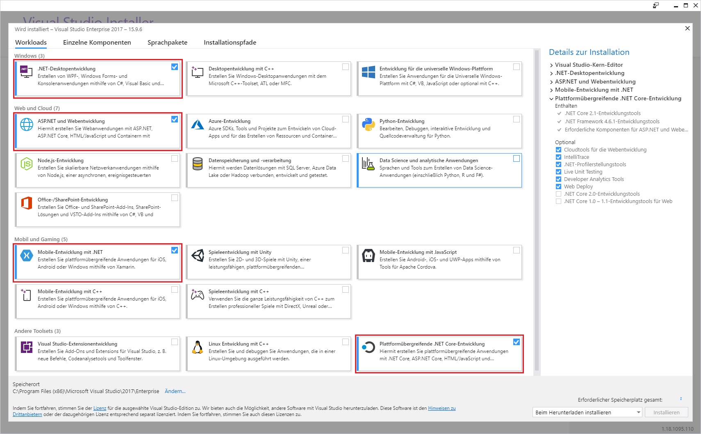
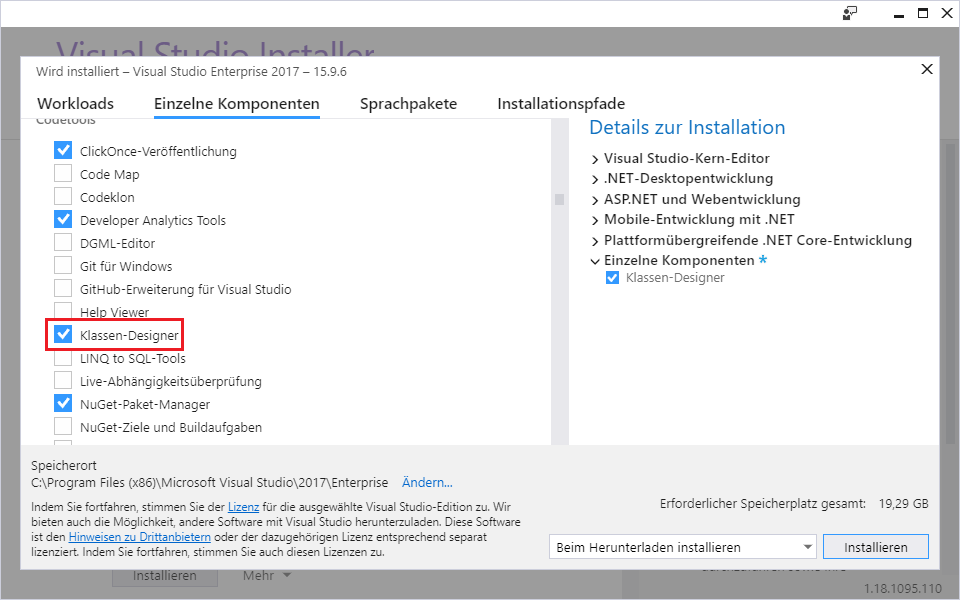
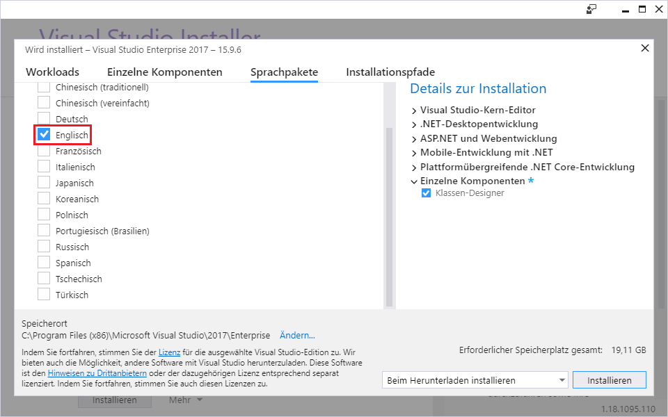

# Installation von Visual Studio 2017/2019

## Download der Installationsdateien
Der Installer kann von der [Visual Studio Installationsseite](https://visualstudio.microsoft.com/de/downloads/)
heruntergeladen werden. Wähle die *Enterprise* Version, da die Schule eine Lizenz hierfür von Microsoft
hat. Der Key wird im Unterricht bekannt gegeben.

## Auswählen der Komponenten
Es sollten rund 20 GB Platz auf der Festplatte für die folgenden Komponenten sein. Wenn der Speicher auf
der SSD knapp wird, kann die Software [PatchCleaner](https://sourceforge.net/projects/patchcleaner/)
alte Windowsinstallationen, die als Backup bei Windows Updates erhalten bleiben, entfernen. Nach dem 
Starten des Installers können die Komponenten ausgewählt werden.

**Workloads:** (1) .NET Entwicklung, (2) ASP.NET Entwicklung, (3) Mobile Entwicklung (für die 4. Klasse), 
(4) Plattformübergreifende .NET Core Entwicklung, (5) Universal WIndows Platform development

**Einzelne Komponenten:** Zusätzlich wird Klassen-Designer angewählt, um die Klassenmodelle öffnen zu
können. Sonst wird nur eine XML Datei angezeigt.

**Sprachpakete:** Da es zu deutschen Fehlermeldungen auf Google wenig geben wird, und die Übersetzungen
manchmal sehr kreativ sind, wähle hier Englisch als Sprache.

## Freischaltung
Unter *Help* - *Register Product* kann der Produktkey der Schule eingegeben werden.

