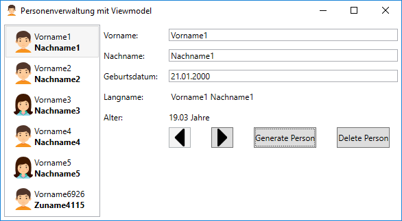

# Listen und ObservableCollection


In diesem Beispiel sollen alle Personen in einer Liste dargestellt werden. Beim Klicken auf einen
Eintrag der Liste werden die Daten geladen. Diese Features werden durch eine *ListBox* bereitgestellt.
Da Person ein komplexer Typ ist, muss über ein *DataTemplate* die Anzeige in der ListBox gesteuert werden.
Folgendes Beispiel zeigt *Firstname* und *Lastname* untereinander an:

```xml
<ListBox DockPanel.Dock="Left" ItemsSource="{Binding Persons}" SelectedItem="{Binding CurrentPerson}">
    <ListBox.ItemTemplate>
        <DataTemplate>
            <DockPanel Margin="5 5 5 5">
                <StackPanel>
                    <TextBlock Text="{Binding Firstname}" />
                    <TextBlock FontWeight="Bold" Text="{Binding Lastname}" />
                </StackPanel>
            </DockPanel>
        </DataTemplate>
    </ListBox.ItemTemplate>
</ListBox>
```

Dabei ist *Persons* die Collection von Personen in *MainViewModel*, *CurrentPerson* ist das Property in
*MainViewModel*, in welches die Liste die aktuell ausgewählte Person hineinschreibt. Es muss natürlich
daher ein public set Property sein.

Für die Darstellung von Listen gibt es in WPF mehrere Controls:

*<sup>Quelle: http://www.sws.bfh.ch/~amrhein/Skripten/Info2/, Kapitel 8: WPF Listen und Tabellen</sup>*

## Listen und das dazugehörige Property - zwei Ansätze
Listen binden sich an eine Collection im ViewModel. Diese Collection muss natürlich bereitgestellt
werden. Das kann auf mehrere Arten passieren:

### Ansatz 1: Erstellen der Collection mittels LINQ Abfrage aus dem Model
Hier wird in *get* des Properties eine LINQ Abfrage geschrieben, die die Daten aus dem Model holt. Gegebenenfalls
muss mit *ToList()* die Ausführung erzwungen werden, damit z. B. die Daten aus der Datenbank gelesen werden.

Werden nun die zugrundeliegenden Daten über die GUI geändert (hinzufügen oder löschen von Elementen), 
muss über *PropertyChanged()* die Liste neu eingelesen werden. Bei einer Änderung der Objekte selbst wird 
die Änderung sofort dargestellt, da es sich bei der Liste nur um Referenzen auf die Originalobjekte 
handelt. Dennoch muss folgendes beachtet werden:
- Der Aufruf von *PropertyChanged()* muss immer beim Hinzufügen oder Löschen erfolgen, um eine konsistente 
  Darstellung zu gewährleisten.
- *PropertyChanged()* liest die Liste zur Gänze neu ein. Bei einer langsamen Quelle (z. B. einem Webservice)
  kann hier eine Latenz für den Anwender entstehen, vor allem wenn sehr häufig Objekte manipuliert werden.

### Ansatz 2: Arbeiten über eine *ObservableCollection*
In diesem Ansatz wird im ViewModel eine eigene Liste definiert, die die Personenobjekte in unserem Beispiel
speichert. Bei einer normalen Liste müssten wir beim Hinzufügen oder Löschen folgende Schritte ausführen:
- Hinzufügen des Objektes in der Liste im Viewmodel
- Hinzufügen des Objektes im Model
- Aufruf von *PropertyChanged()* 

Mit einer *ObservableCollection* wird automatisch beim Hinzufügen oder Löschen von Elementen ein Event
(*CollectionChanged*) geworfen, auf das wir zentral reagieren können. Der Aufruf von *PropertyChanged()* 
entfällt, da die ObservableCollection das Interface *INotifyPropertyChanged* implementiert.

Fügen wir nun eine Person durch die Logik in *GeneratePersonCommand* zur ObservableCollection im ViewModel
hinzu, wird zwar die GUI ohne unser Zutun aktualisiert, die Person wird aber nicht im Model gespeichert. 
Es entsteht folgende Situation:


Das neue Objekt wird zwar  zur ObservableCollection hinzugefügt, das Model weiß aber nichts davon. Es 
ist ein *"untracked object"*. Diesen Fall kann auf 2 Arten gelöst werden.
**Ansatz 1:** Im ViewModel wird der Event *CollectionChanged* abonniert. Im Eventhandler wird mit folgendem Code
  die Person im Model eingetragen oder gelöscht (je nach Änderung der Liste):
```c#
private void PersonObservable_CollectionChanged(object sender, NotifyCollectionChangedEventArgs e)
{
    foreach (Person p in e.NewItems?.Cast<Person>() ?? Enumerable.Empty<Person>())
    {
        personDb.Person.Add(p);
    }
    foreach (Person p in e.OldItems?.Cast<Person>() ?? Enumerable.Empty<Person>())
    {
        personDb.Person.Remove(p);
    }
}
```

**Ansatz 2:** Wir leiten von *ObservableCollection&lt;T&gt;* eine eigene Klasse *SynchronizedObservable&lt;T&gt;*
ab. Diese Klasse wird im Beispiel verwendet und kann nun für alle Basiscollections, in die zurückgeschrieben
werden soll, verwendet werden.
```c#
public class SynchronizedObservable<T> : ObservableCollection<T>
{
    private readonly ICollection<T> sourceCollection;

    public SynchronizedObservable(ICollection<T> sourceCollection) : base(sourceCollection)
    {
        this.sourceCollection = sourceCollection;
        CollectionChanged += SynchronizedObservable_CollectionChanged;
    }

    private void SynchronizedObservable_CollectionChanged(object sender, NotifyCollectionChangedEventArgs e)
    {
        foreach (T p in e.NewItems?.Cast<T>() ?? Enumerable.Empty<T>())
        {
            sourceCollection.Add(p);
        }
        foreach (T p in e.OldItems?.Cast<T>() ?? Enumerable.Empty<T>())
        {
            sourceCollection.Remove(p);
        }
    }
}
```


