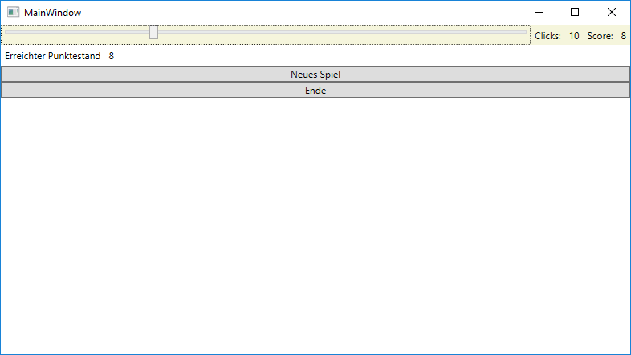

# Übung: Ergänzungen zu CatchTheBall (ohne Viewmodel)
Verwende als Ausgangsbasis für die Implementierung des Beispieles den Mustercode 
*[WPF/01 CatchTheBall](https://github.com/schletz/Pos3xhif/tree/master/WPF/01%20CatchTheBall)*. Am Ende des Spieles 
(wenn 10 mal gelickt wurde) soll eine abschließende Ansicht angezeigt werden:

## Löse folgende Aufgaben

1. Erstelle ein *StackPanel*, welches am Anfang ausgeblendet wird (*Visibility="Hidden"*). Ordne das 
    StackPanel dem Grid zu (Zeile 1). Da es ausgeblendet ist, kann die Zelle im Grid "doppelt belegt" 
    werden.
1. Nach dem 10. Klick wird das StackPanel eingeblendet und der Canvas (*EllipseContainer*) ausgeblendet.
1. Der erreichte Punktestand in der abschließenden Ansicht soll über Binding auf den angezeigten 
    Punktestand im Label Score zugreifen.
1. Beim Klick auf *Ende* soll die Applikation über *Close()* geschlossen werden.
1. Beim Klick auf *Neues Spiel* sollen die Zähler zurückgesetzt und *EllipseContainer* wieder 
    angezeigt werden.
1. Der Wert der Visibility kann in C# mit *Visibility.Hidden* oder *Visibility.Visible* (Enumeration) 
    gesetzt werden.
1. Verwende für die Buttons das Control *Button*. Der Eventhandler soll beim Event *Click* gefeuert
    werden (nicht bei Mouse down). Die Texte sind den Buttons über das Attribut *Content* zuzuweisen.

## Führe folgende Tests durch:
- Werden die Zähler zu Beginn jedes Spieles auf 0 gesetzt?
- Erscheint die Abschlussansicht nach dem 10. Klick und steht im Label Clicks auch 10?