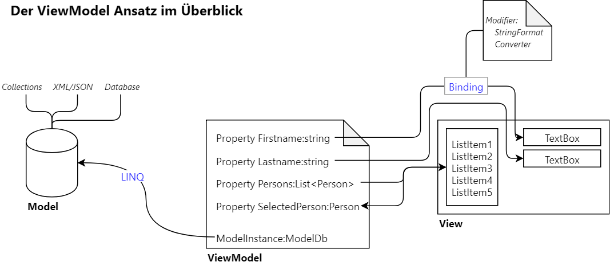

# Erste MVVM Applikation

Diese Applikation benutzt alle 3 Teile der MVVM (Model View ViewModel) Architektur: Ein **Model** in Form einer Personen-Datenbank.
Ein **ViewModel**, welches die Binding Properties bereitstellt. Die *View*, die mittels Binding auf 
das ViewModel zugreift.

Folgende Themen werden behandelt:
- Setzen des *DataContext* in XAML auf das ViewModel.
- Bindingoptionen (StringFormat, Multibinding, Converter)
- RelayCommand und Command Bindings

Das Zusammenspiel der Komponenten wird bei folgender Grafik deutlich:

Grafik erstellt mit [draw.io].

[draw.io]: https://www.draw.io/