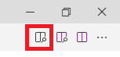
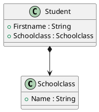

# VS Code und Markdown

## PlantUML und VS Code als Modellierungswerkzeug

In der Konzeptionierungsphase ist ein grafisches Tool zum Erzeugen von Klassenmodellen sehr wichtig.
In diesen Kurs werden immer wieder UML Klassendiagramme hergezeigt. Sie können mit VS Code und
PlantUML erzeugt werden:

1. Prüfe, ob Java installiert und im PATH eingetragen ist. Der Befehl *java -version* muss erkannt
   werden. Falls nicht, lade von *https://openjdk.java.net/* die neuste Version von OpenJDK und
   füge den Pfad von java.exe im bin Verzeichnis der PATH Variable hinzu.
1. Installiere [Visual Studio Code](https://code.visualstudio.com). Achtung: Aktiviere beim Setup
   die Option "In den Explorer integrieren", damit Sie im Kontextmenü VS Code starten können.
1. Installiere die folgenden Extensions:
   - Markdown PDF
   - Markdown Preview Enhanced
   - PlantUML
1. Öffne die VS Code Konfiguration (*F1* - "*settings*" eingeben - "*Preferences: Open Settings (JSON)*" wählen)
   und füge folgende Zeilen hinzu:

```javascript
    "markdown-pdf.plantumlOpenMarker": "```plantuml",
    "markdown-pdf.plantumlCloseMarker": "```"   
```

Nun steht durch die Extension *Markdown Preview Enhanced* ein Icon bereit, welches eine Vorschau
mit dem gerenderten Diagramm bietet. Beachte: Dies ist nur bei Dokumenten mit der 
Endung *.md* Verfügbar.



Zum Testen kann nun eine neue Datei *Modell.md* mit folgendem Inhalt erstellt werden:

````
# Ein Klassenmodell

Das ist die Beschreibung.

````

## Markdown als LaTex Dokument exportieren

- **Pandoc Installation:** Zuerst muss die Software [Pandoc](https://pandoc.org/installing.html) installiert werden.
  Installiere die Software am Besten in *C:\Pandoc*. Prüfe danach in der Konsole mit dem Befehl
  *pandoc -v*, ob die Datei *pandoc.exe* in der PATH Variable gefunden wird.
- **rsvg-convert:** Lade die neueste Version von [rsgv-convert](https://github.com/miyako/console-rsvg-convert/releases)
  Für Windows steht nicht immer ein Build zur Verfügung, aktuell (8.3.2022) ist in der Version 2.1
  unter Assets eine x64-static Version vorhanden. Entpacke die EXE Datei und kopiere sie in das
  Verzeichnis *C:\Pandoc*, welches im vorigen Schritt angelegt wurde.
- **vscode-pandoc Extension:** Danach wird in VS Code die Extension *vscode-pandoc* installiert.
- **settings.json** Öffne die Datei *settings.json* mit *F1* oder *STRG+SHIFT+P* und dem Menüpunkt 
  *Preferences: Open Settings (JSON)* Füge die nachfolgende Konfiguration für Pandoc
  ein. Sie legt A4 als Dokumentgröße fest und ermöglicht das Rendern von Texten mit Backslash (*markdown-raw_tex*)

```
"pandoc.pdfOptString": "-f markdown-raw_tex -V documentclass=article -V geometry:a4paper -V geometry:margin=2.5cm -V geometry:nohead"
```

Ist alles installiert, kann in der Command Palette (*F1* oder *STRG+SHIFT+P*) im Menü Pandoc ein PDF
erzeugt werden.
